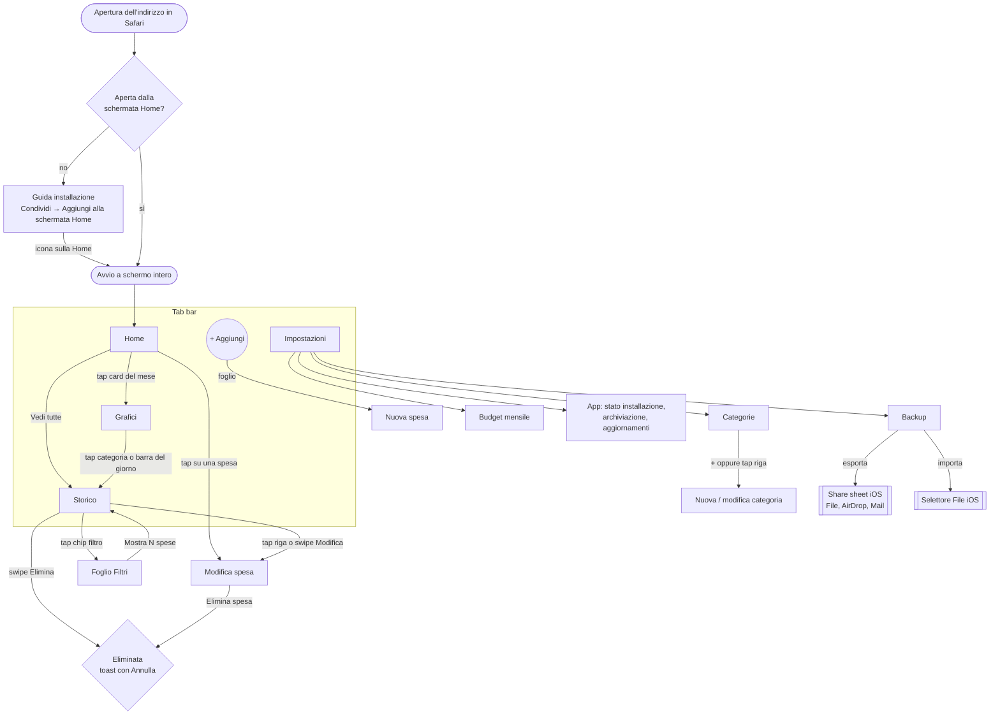
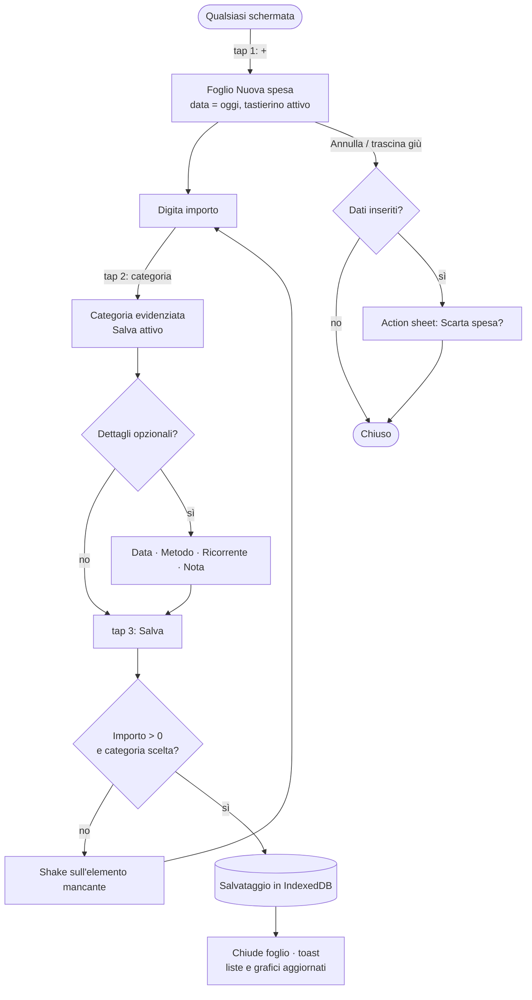
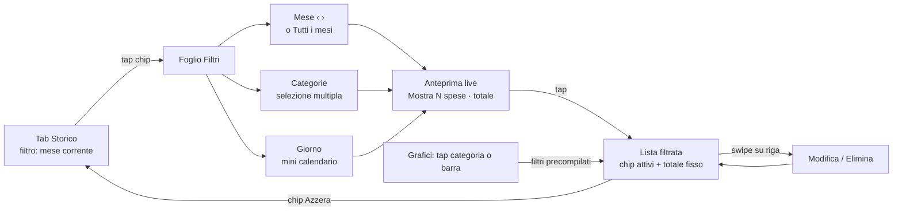
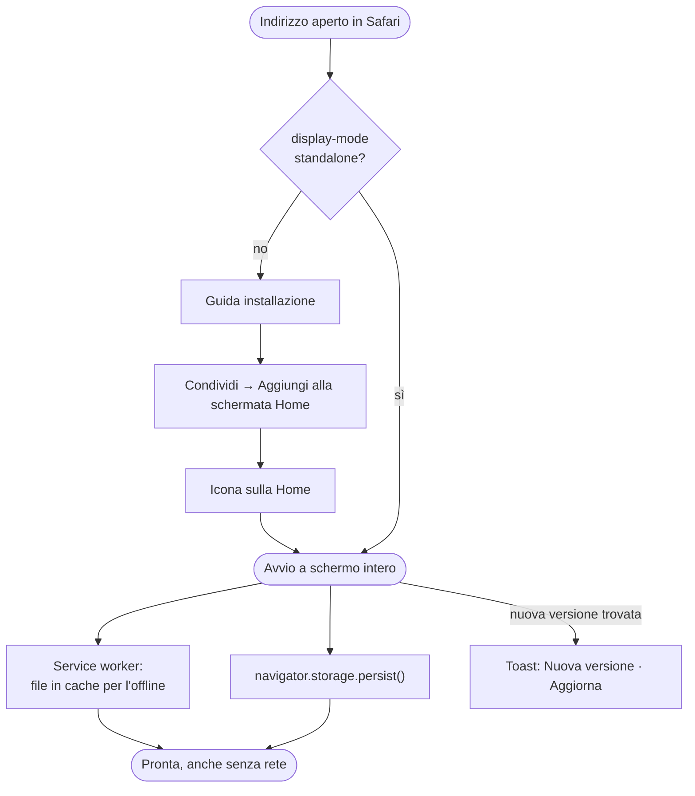
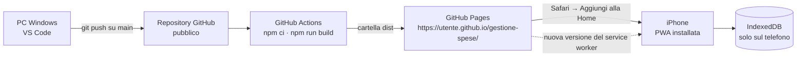
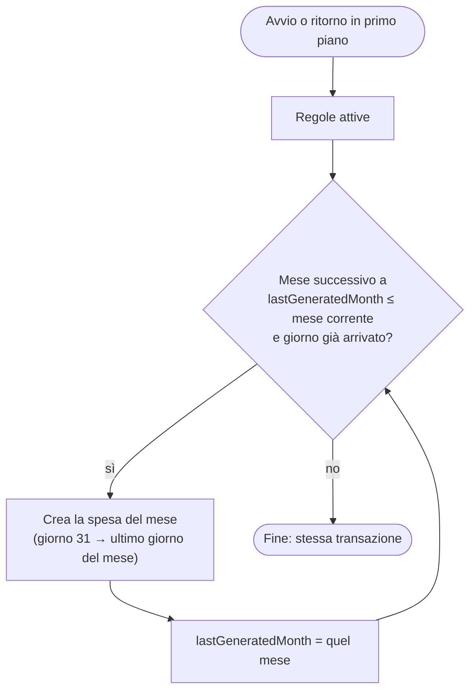
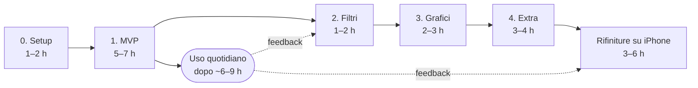

# 💶 Spese — Proposta per una PWA iPhone di tracciamento spese

> **Versione 1.0 · proposta confermata** · 19 settembre 2026 — tutte le decisioni sono prese (vedi [`punti-aperti.md`](punti-aperti.md) e [§ 5.4](#54-decisioni-prese)); completate le sezioni 3 (Database) e 4 (Implementazione).
> **Piattaforma**: l'app è una **PWA** (web app installata sulla schermata Home) e non un'app nativa Expo/React Native, perché è solo per uso personale e non si vuole pagare l'Apple Developer Program (confronto in [§ 2.4](#24-confronto-con-lalternativa-nativa-expo)).

## Sommario

- **Obiettivo**: registrare una spesa in **3 tap + importo** e capire a colpo d'occhio quanto si spende. Niente login, niente backend: dati solo sull'iPhone, funziona offline.
- **Forma**: **PWA** aperta da Safari e aggiunta alla schermata Home → si avvia a schermo intero come un'app, **gratis**, senza Mac, senza account Apple, senza scadenze.
- **Stack**: **Vite + React + TypeScript**, `vite-plugin-pwa` (service worker e manifest), React Router, **Dexie.js su IndexedDB**, grafici SVG su misura, `date-fns` (locale `it` ed `enIE`), dizionari IT/EN su misura, Zustand, `motion` per fogli e swipe, `lucide-react` per le icone.
- **Hosting**: **GitHub Pages** con repository **pubblico** e deploy automatico via GitHub Actions a ogni push su `main` → `https://<utente>.github.io/gestione-spese/`. Il repository contiene solo codice: le spese restano sull'iPhone.
- **Navigazione**: tab bar con **pulsante centrale "+"** che apre un foglio con **tastierino numerico integrato** (evita la tastiera iOS e lo zoom automatico di Safari).
- **Dati**: importi come **interi in centesimi**, date come testo locale `YYYY-MM-DD`, archiviazione persistente richiesta al browser, **backup JSON/CSV** con lo share sheet di iOS (Web Share API).
- **Rischio principale**: i dati vivono nello spazio della PWA installata: **rimuovere l'icona dalla Home li cancella**, e quelli inseriti in Safari prima dell'installazione non passano all'app → guida all'installazione al primo avvio e backup facile fin dall'MVP.
- **Tempi stimati**: **15–25 ore** di lavoro effettivo (4–6 sessioni, 1–2 settimane di calendario); l'**MVP usabile ogni giorno** in circa **6–9 ore** ([§ 4.1](#41-piano-di-lavoro-e-stima-dei-tempi)).
- **Lingue**: interfaccia in **italiano (predefinito) e inglese**, scelta in Impostazioni; importi e date nel formato della lingua (`1.234,56 €` / `€1,234.56`).
- **Prototipo interattivo**: [`prototipo-app-spese.html`](prototipo-app-spese.html), design da implementare (aprire nel browser).

## Indice

1. [Prototipo UX/UI](#1-prototipo-uxui)
   - [1.1 Principi di design](#11-principi-di-design)
   - [1.2 Mappa di navigazione](#12-mappa-di-navigazione)
   - [1.3 Schermate](#13-schermate)
   - [1.4 Flussi utente](#14-flussi-utente)
   - [1.5 Design system](#15-design-system)
   - [1.6 Prototipo interattivo HTML](#16-prototipo-interattivo-html)
2. [Tecnologia](#2-tecnologia)
   - [2.1 Stack confermato](#21-stack-confermato)
   - [2.2 Librerie scelte](#22-librerie-scelte)
   - [2.3 Cosa può e non può fare una PWA su iPhone](#23-cosa-può-e-non-può-fare-una-pwa-su-iphone)
   - [2.4 Confronto con l'alternativa nativa (Expo)](#24-confronto-con-lalternativa-nativa-expo)
   - [2.5 Hosting e deploy su GitHub Pages](#25-hosting-e-deploy-su-github-pages)
3. [Database](#3-database)
   - [3.1 Dove stanno i dati](#31-dove-stanno-i-dati)
   - [3.2 Tabelle](#32-tabelle)
   - [3.3 Schema Dexie e indici](#33-schema-dexie-e-indici)
   - [3.4 Categorie predefinite e seed](#34-categorie-predefinite-e-seed)
   - [3.5 Query principali](#35-query-principali)
   - [3.6 Spese ricorrenti](#36-spese-ricorrenti)
   - [3.7 Backup ed esportazione](#37-backup-ed-esportazione)
   - [3.8 Migrazioni](#38-migrazioni)
4. [Implementazione](#4-implementazione)
   - [4.1 Piano di lavoro e stima dei tempi](#41-piano-di-lavoro-e-stima-dei-tempi)
   - [4.2 Ambiente di sviluppo](#42-ambiente-di-sviluppo)
   - [4.3 Struttura delle cartelle](#43-struttura-delle-cartelle)
   - [4.4 Step e criteri di completamento](#44-step-e-criteri-di-completamento)
   - [4.5 Controlli automatici e pubblicazione](#45-controlli-automatici-e-pubblicazione)
5. [Rischi e punti aperti](#5-rischi-e-punti-aperti)
   - [5.1 Limiti noti e rischi](#51-limiti-noti-e-rischi)
   - [5.2 Requisiti che semplificherei](#52-requisiti-che-semplificherei)
   - [5.3 Requisiti mancanti](#53-requisiti-mancanti)
   - [5.4 Decisioni prese](#54-decisioni-prese)

---

## 1. Prototipo UX/UI

### 1.1 Principi di design

| Principio | Cosa significa nell'app |
|---|---|
| **Velocità prima di tutto** | Il "+" è raggiungibile da ogni schermata; il tastierino è già attivo all'apertura; la data è già "oggi"; tutti i campi opzionali sono chip a un tap, mai form lunghi. |
| **A colpo d'occhio** | La Home risponde a tre domande: *quanto ho speso questo mese?*, *è tanto rispetto al mese scorso?*, *quanto mi resta del budget?* |
| **Feeling iOS anche sul web** | Large title, liste "inset grouped", fogli dal basso con trascinamento, swipe actions, colori e font di sistema, dark mode, aree sicure (notch, home indicator). Dove il web non arriva (aptica) si compensa con feedback visivi curati. |
| **È un'app, non un sito** | Avvio dalla Home a schermo intero, nessuna barra di Safari, funziona offline, nessun link esterno che faccia uscire dall'app. |
| **Perdonare gli errori** | Eliminazione con "Annulla" nel toast, modifica sempre possibile, conferma solo per azioni distruttive di massa. |
| **I dati sono tuoi** | Nessun server, backup esportabile in un tocco, promemoria se il backup è vecchio. |

### 1.2 Mappa di navigazione

La struttura è una **tab bar a 5 elementi**: 4 sezioni + azione centrale "Aggiungi", che apre un foglio sopra la tab corrente. Prima c'è un passaggio che nelle app native non esiste: **l'installazione dalla pagina Safari**.



| Schermata | Presentazione | Implementazione web (indicativa) |
|---|---|---|
| Home | Tab | Route `#/` |
| Storico | Tab | Route `#/history` (filtri anche nella query, es. `#/history?month=2026-09&cat=spesa`) |
| Grafici | Tab | Route `#/charts?month=2026-09` |
| Impostazioni | Tab | Route `#/settings` |
| Categorie | Pagina con pulsante "‹ Impostazioni" | Route `#/settings/categories` |
| Spese ricorrenti (fase 4) | Pagina con pulsante "‹ Impostazioni" | Route `#/settings/recurring` |
| Nuova / modifica spesa | Foglio dal basso a tutta altezza | Componente `Sheet` aperto da stato globale |
| Filtri | Foglio dal basso | Componente `Sheet` |
| Nuova / modifica categoria | Foglio dal basso | Componente `Sheet` |
| Esporta / conferme | Action sheet | Componente `ActionSheet` |
| Guida installazione | Foglio mostrato solo se l'app è aperta in Safari | `display-mode: standalone` non attivo |

> Le route usano il **`#`** (`https://<utente>.github.io/gestione-spese/#/history`): GitHub Pages non sa reindirizzare gli indirizzi interni all'app, e con il `#` il server riceve sempre solo `/gestione-spese/` (vedi [§ 2.5](#25-hosting-e-deploy-su-github-pages)).
>
> In una PWA avviata dalla Home non esistono il pulsante "indietro" del browser né lo swipe dal bordo per tornare indietro: ogni pagina secondaria ha un **pulsante "‹" esplicito** e i fogli si chiudono con `Annulla` o trascinandoli verso il basso.

### 1.3 Schermate

> Legenda wireframe: `(S)` = icona categoria colorata, `[ ]` = pulsante/chip, `▾` = apre un selettore, `›` = navigazione, `↻` = spesa ricorrente, `(!)` = avviso.

#### 1.3.1 Home / Dashboard

**Scopo** — Dare in 2 secondi il quadro del mese in corso e le ultime spese inserite.

**Elementi**
- Large title "Spese" con data odierna estesa ("mercoledì 16 settembre").
- **Banner "Installa Spese sulla Home"**: visibile **solo se la pagina è aperta in Safari** (non installata), con link alla guida; si può chiudere.
- **Card del mese**: totale speso, variazione % rispetto allo *stesso periodo* del mese precedente, barra di avanzamento del budget (se impostato) con importo residuo e giorni rimanenti.
- **Due mini-card**: speso oggi, media giornaliera del mese.
- **Top categorie**: le 3–4 categorie con più spesa, con barra proporzionale.
- **Ultime spese**: 5 righe con link "Vedi tutte".

**Interazioni**
- Tap sulla card del mese → Grafici del mese corrente.
- Tap su una spesa → foglio "Modifica spesa"; swipe verso sinistra → Modifica / Elimina.
- "+" nella tab bar → foglio "Nuova spesa".
- Stato vuoto (primo avvio): illustrazione leggera + pulsante "Aggiungi la prima spesa".
- Nuova versione dell'app scaricata in background → toast "Nuova versione disponibile · **Aggiorna**".

```text
┌─────────────────────────────────────────────┐
│ 9:41                                ▮▮▮ ◠ ▭ │
│ MERCOLEDÌ 16 SETTEMBRE                      │
│ Spese                                       │
├─────────────────────────────────────────────┤
│ [↓] Installa Spese sulla Home             ✕ │
│     Offline, a schermo intero · Come fare › │
├─────────────────────────────────────────────┤
│ SPESO A SETTEMBRE                           │
│ 1.284,60 €                                  │
│ [▲ +12%] vs agosto (stesso periodo)         │
│ ████████████████░░░░ 86% di 1.500 €         │
│ Restano 215,40 €                  14 giorni │
├─────────────────────────────────────────────┤
│ OGGI                        MEDIA AL GIORNO │
│ 23,40 €                             80,29 € │
├─────────────────────────────────────────────┤
│ TOP CATEGORIE                     Grafici › │
│ (S) Spesa      ██████████          412,30 € │
│ (R) Ristoranti ██████              236,50 € │
│ (T) Trasporti  ████                168,00 € │
├─────────────────────────────────────────────┤
│ ULTIME SPESE                   Vedi tutte › │
│ (S) Esselunga                       34,20 € │
│     Spesa · Carta · Oggi                    │
│ (T) Benzina                         60,00 € │
│     Trasporti · Carta · Ieri                │
├─────────────────────────────────────────────┤
│ Home  Storico  [ + ]  Grafici  Impostaz.    │
└─────────────────────────────────────────────┘
```

#### 1.3.2 Inserimento / modifica spesa

**Scopo** — Registrare una spesa standard con **massimo 3 tap + digitazione dell'importo**.

**Elementi**
- Foglio dal basso a tutta altezza (la schermata sotto si rimpicciolisce, come su iOS) con barra: `Annulla` · titolo · `Salva` (grigio finché mancano importo o categoria).
- **Importo grande** (font rounded, cifre tabellari): mentre si digita, le cifre decimali non ancora inserite sono in grigio (`12,5` → `12,5`**`0`** `€`).
- **Griglia categorie** a 4 colonne (icona + nome; con le 9 predefinite 3 righe, "Altro" nell'ultima); la selezionata si riempie del suo colore.
- **Chip dettagli** (tutti opzionali, un tap ciascuno):
  - `Oggi` → mostra `Oggi` / `Ieri` / selettore data nativo di iOS (`<input type="date">`);
  - `Carta` → cicla Carta → Contanti → Altro (predefinito impostabile);
  - `Una tantum` ↔ `Ogni mese` (ricorrente mensile, dalla fase 4: crea una regola, [§ 3.6](#36-spese-ricorrenti)).
- Campo **Nota** a una riga (max 40 caratteri, testo a 17 px per evitare lo zoom automatico di Safari).
- **Tastierino numerico integrato** (non la tastiera di sistema): cifre, virgola, cancella. Massimo 2 decimali e 6 cifre intere.
- In modalità **Modifica**: stessi campi precompilati + pulsante rosso "Elimina spesa" in fondo.

**Interazioni**
- Apertura: tastierino già pronto, data = oggi, metodo = predefinito.
- Tap categoria → l'icona "rimbalza" e si colora, `Salva` si attiva se l'importo è > 0.
- `Salva` non valido → animazione "shake" sull'elemento mancante (non esiste vibrazione nelle web app iOS).
- `Annulla` o trascinamento verso il basso con dati inseriti → action sheet "Scarta spesa?".
- Dopo il salvataggio: il foglio si chiude, toast "12,50 € aggiunti a Ristoranti", liste e grafici si aggiornano.

```text
┌─────────────────────────────────────────────┐
│ Annulla          Nuova spesa          Salva │
├─────────────────────────────────────────────┤
│                                             │
│                   12,5_ €                   │
│  (la cifra mancante è mostrata in grigio)   │
│                                             │
│    (S)       (T)      ((R))      (C)        │
│   Spesa     Trasp.    Ristor.    Casa       │
│    (+)       (V)       (A)       (L)        │
│   Salute    Svago    Abbonam.   Lavoro      │
│    (…)                                      │
│   Altro                                     │
├─────────────────────────────────────────────┤
│ [▦ Oggi]  [▭ Carta]  [↻ Una tantum]         │
│ [ Nota (es. Esselunga, benzina)       ]     │
├─────────────────────────────────────────────┤
│         1            2            3         │
│         4            5            6         │
│         7            8            9         │
│         ,            0            ⌫         │
└─────────────────────────────────────────────┘
```

#### 1.3.3 Storico

**Scopo** — Consultare tutte le spese, filtrarle e correggerle.

**Elementi**
- Large title "Storico".
- **Barra filtri** con chip scorrevoli: `Settembre 2026 ▾` · `Categorie ▾` · `Giorno ▾` · `Azzera` (visibile solo se i filtri differiscono dal default). I chip attivi sono colorati con il colore d'accento.
- **Totale filtrato sempre visibile**: banner che resta fissato in alto durante lo scroll (totale + numero di spese).
- **Lista raggruppata per giorno**: intestazione con data relativa ("Oggi · mer 16 set", "Ieri", "Lunedì 14 settembre") e **totale giornaliero**.
- Righe: icona categoria, nota (o nome categoria), sottotitolo "categoria · metodo", importo, simbolo ↻ se ricorrente.

**Interazioni**
- Tap su un chip filtro → foglio Filtri.
- **Swipe verso sinistra** su una riga → azioni `Modifica` (accento) ed `Elimina` (rosso); swipe lungo = elimina.
- Tap su una riga → Modifica (così ogni azione è raggiungibile anche senza gesti).
- Eliminazione → la riga si chiude con animazione, toast "Spesa eliminata · **Annulla**" per 4–5 secondi.
- Nessun risultato → stato vuoto "Nessuna spesa con questi filtri" + pulsante "Azzera filtri".

```text
┌─────────────────────────────────────────────┐
│ Storico                                     │
│ [Settembre 2026 ▾] [Categorie ▾] [Giorno ▾] │
├─────────────────────────────────────────────┤
│ TOTALE FILTRATO                  1.284,60 € │
│ 48 spese                                    │
├─────────────────────────────────────────────┤
│ OGGI · MER 16 SET                   23,40 € │
│ (S) Esselunga                       20,90 € │
│     Spesa · Carta                           │
│ (R) Caffè                            2,50 € │
│     Ristoranti · Contanti                   │
├─────────────────────────────────────────────┤
│ IERI · MAR 15 SET                   60,00 € │
│ (T) Benzina                         60,00 € │
│     Trasporti · Carta                       │
├─────────────────────────────────────────────┤
│     riga dopo lo swipe verso sinistra:      │
│ rmacia   8,40 €        [Modifica] [Elimina] │
├─────────────────────────────────────────────┤
│ Home  Storico  [ + ]  Grafici  Impostaz.    │
└─────────────────────────────────────────────┘
```

#### 1.3.4 Foglio Filtri

**Scopo** — Combinare mese, categorie e giorno con un'anteprima immediata del risultato.

**Elementi**
- Barra: `Annulla` · "Filtri" · `Azzera`.
- **Mese**: selettore `‹ Settembre 2026 ›` + interruttore "Tutti i mesi".
- **Categorie**: chip a selezione multipla.
- **Giorno**: mini-calendario del mese (settimana da lunedì), puntino sotto i giorni con spese, giorni futuri disattivati.
- **Cerca nelle note**: campo di testo (17 px) che filtra le spese la cui nota contiene il testo, senza distinzione di maiuscole e accenti; nella barra dello Storico compare come chip `"esselunga" ✕`.
- Pulsante principale con **anteprima live**: "Mostra 12 spese · 187,40 €".

**Interazioni**
- Scegliere un giorno imposta automaticamente anche il suo mese; cambiare mese azzera il giorno se non appartiene al nuovo mese.
- Tap su un giorno già selezionato → deseleziona.
- `Annulla` chiude senza applicare; `Azzera` riporta al default (mese corrente, tutte le categorie, qualsiasi giorno).

```text
┌─────────────────────────────────────────────┐
│ Annulla            Filtri            Azzera │
├─────────────────────────────────────────────┤
│ MESE                                        │
│ ‹              Settembre 2026             › │
│ Tutti i mesi                          (○  ) │
├─────────────────────────────────────────────┤
│ CATEGORIE (anche più di una)                │
│ [✓ Spesa] [Trasporti] [✓ Ristoranti]        │
│ [Casa] [Salute] [Svago] [Abbonamenti]       │
│ [Lavoro] [Altro]                            │
├─────────────────────────────────────────────┤
│ GIORNO                                      │
│   L   M   M   G   V   S   D                 │
│       1   2   3   4   5   6                 │
│   7   8   9  10  11  12  13                 │
│  14  15 [16] 17  18  19  20                 │
│  21  22  23  24  25  26  27                 │
│  28  29  30                                 │
├─────────────────────────────────────────────┤
│      [  Mostra 12 spese · 187,40 €  ]       │
└─────────────────────────────────────────────┘
```

#### 1.3.5 Grafici

**Scopo** — Capire dove vanno i soldi nel mese e come sta andando rispetto al precedente.

**Elementi**
- Selettore mese `‹ Settembre 2026 ›` (non si va oltre il mese corrente).
- **Card riepilogo**: totale del mese + pillola variazione % vs mese precedente (▲ rosso = spendo di più, ▼ verde = spendo di meno). Per il mese in corso il confronto è sullo **stesso periodo** (1–16 agosto vs 1–16 settembre); per i mesi chiusi sul mese intero.
- **Ciambella per categoria** con totale al centro e legenda (categoria, %, importo).
- **Barre giornaliere** del mese: oggi evidenziato, linea tratteggiata della media, giorni futuri vuoti.
- **Budget** (se impostato): barra di avanzamento con soglie di colore (verde < 80%, arancio 80–100%, rosso > 100%) e **proiezione a fine mese**.

**Interazioni**
- Tap su uno spicchio o su una voce della legenda → evidenzia la categoria (centro della ciambella mostra importo e %) + link "Vedi nello storico ›" con filtri precompilati.
- Tap su una barra → mostra giorno e importo + link "Apri giorno ›".
- Swipe orizzontale sull'area grafici → mese precedente/successivo (in aggiunta alle frecce).

```text
┌─────────────────────────────────────────────┐
│ Grafici                                     │
│ ‹              Settembre 2026             › │
├─────────────────────────────────────────────┤
│ TOTALE DEL MESE                   VS AGOSTO │
│ 1.284,60 €                         [▲ +12%] │
│ Agosto, stesso periodo: 1.147,00 €          │
├─────────────────────────────────────────────┤
│ PER CATEGORIA                               │
│      .-~~~-.         ● Spesa       32%      │
│    /  .---.  \       ● Ristoranti  18%      │
│   |  |1.284 |  |     ● Trasporti   13%      │
│    \  '---'  /       ● Casa        11%      │
│      '-~~~-'         ● Altre       26%      │
├─────────────────────────────────────────────┤
│ ANDAMENTO GIORNALIERO            media 80 € │
│ ▃ ▅ ▁ █ ▂ ▆ ▃ █ ▄ ▂ ▅ ▁ ▆ ▂ █ ▂ · · · ·     │
│ 1             8             15      30      │
├─────────────────────────────────────────────┤
│ BUDGET                       86% di 1.500 € │
│ ████████████████░░░░                        │
│ Proiezione a fine mese: 2.408 € (!)         │
└─────────────────────────────────────────────┘
```

#### 1.3.6 Impostazioni

**Scopo** — Raccogliere le poche preferenze, la gestione dei dati e lo stato dell'app web.

**Elementi** (lista "inset grouped" stile Impostazioni di iOS)
- **Budget**: budget mensile (vuoto = nessun budget, la card sparisce).
- **Personalizzazione**: Categorie ›, metodo di pagamento predefinito, aspetto (Automatico / Chiaro / Scuro).
- **Dati e backup**: Esporta backup (JSON), Esporta per Excel (CSV), Importa backup, data dell'ultimo backup (arancione se > 30 giorni o mai fatto).
- **App**:
  - *Stato*: "Installata ✓" oppure "Aperta in Safari" con link alla guida;
  - *Archiviazione persistente*: "Attiva ✓" se il browser ha concesso `navigator.storage.persist()`;
  - *Spazio usato*: stima dello spazio occupato dai dati;
  - *Versione* e *Cerca aggiornamenti*.

**Interazioni**
- Esporta → action sheet con **Condividi…** (share sheet iOS: Salva su File/iCloud Drive, AirDrop, Mail…), **Scarica file**, **Copia negli appunti**.
- Importa → selettore File di iOS → riepilogo ("312 spese, 9 categorie") → **Sostituisci tutto** oppure **Unisci** (le spese identiche non vengono duplicate).
- Cerca aggiornamenti → il service worker controlla una nuova versione; se c'è, toast "Nuova versione disponibile · Aggiorna".

```text
┌─────────────────────────────────────────────┐
│ Impostazioni                                │
├─────────────────────────────────────────────┤
│ BUDGET                                      │
│ [◎] Budget mensile             1.500,00 € › │
├─────────────────────────────────────────────┤
│ PERSONALIZZAZIONE                           │
│ [#] Categorie                           9 › │
│ [▭] Pagamento predefinito                   │
│     [ Carta | Contanti | Altro ]            │
│ [◐] Aspetto                                 │
│     [ Automatico | Chiaro | Scuro ]         │
├─────────────────────────────────────────────┤
│ DATI E BACKUP                               │
│ [⇪] Esporta backup (JSON)                   │
│ [⇪] Esporta per Excel (CSV)                 │
│ [⇩] Importa backup                          │
│ Ultimo backup              (!) 42 giorni fa │
├─────────────────────────────────────────────┤
│ APP                                         │
│ Stato                          Installata ✓ │
│ Archiviazione persistente          Attiva ✓ │
│ Spazio usato                          48 KB │
│ Versione                              1.0.0 │
│ Cerca aggiornamenti                         │
├─────────────────────────────────────────────┤
│ Home  Storico  [ + ]  Grafici  Impostaz.    │
└─────────────────────────────────────────────┘
```

```text
┌─────────────────────────────────────────────┐
│               Esporta backup                │
│    spese-backup-2026-09-16.json · 20 KB     │
├─────────────────────────────────────────────┤
│                 Condividi…                  │
├─────────────────────────────────────────────┤
│                Scarica file                 │
├─────────────────────────────────────────────┤
│             Copia negli appunti             │
└─────────────────────────────────────────────┘
┌─────────────────────────────────────────────┐
│                   Annulla                   │
└─────────────────────────────────────────────┘
```

#### 1.3.7 Categorie

**Scopo** — Adattare le categorie senza trasformare l'app in un gestionale.

**Elementi**
- Lista categorie attive con icona, nome, numero di spese.
- `+ Nuova categoria` (in barra e in fondo alla lista); pulsante `‹ Impostazioni` per tornare indietro.
- Sezione **Archiviate** (visibile solo se presenti).
- **Foglio categoria**: anteprima icona, nome (max 20 caratteri), 15 colori, 15 icone.

**Regole**
- Le categorie predefinite si possono **rinominare, ricolorare e archiviare** (tranne "Altro"), mai eliminare.
- Ordine fisso: predefinite nell'ordine della tabella di § 1.5, poi quelle create dall'utente per data di creazione (nessun riordino manuale).
- Massimo **15 categorie attive**: oltre, "Nuova categoria" e "Ripristina" sono disattivati con un messaggio.
- Una categoria con spese si **archivia** (sparisce da inserimento e filtri, resta nello storico e nei grafici); una categoria personalizzata senza spese si può eliminare.
- Nomi univoci (confronto senza maiuscole/minuscole).

```text
┌─────────────────────────────────────────────┐
│ ‹ Impostazioni          Categorie         + │
├─────────────────────────────────────────────┤
│ (S) Spesa                       124 spese › │
│ (T) Trasporti                    58 spese › │
│ (R) Ristoranti                   97 spese › │
│ (C) Casa                         21 spese › │
│ (+) Salute                       14 spese › │
│ (V) Svago                        18 spese › │
│ (A) Abbonamenti                  12 spese › │
│ (L) Lavoro                       15 spese › │
│ (…) Altro                         9 spese › │
│ (P) Palestra                      6 spese › │
├─────────────────────────────────────────────┤
│ + Nuova categoria                           │
├─────────────────────────────────────────────┤
│ ARCHIVIATE                                  │
│ (*) Viaggi                       12 spese › │
└─────────────────────────────────────────────┘
```

```text
┌─────────────────────────────────────────────┐
│ Annulla       Modifica categoria      Salva │
├─────────────────────────────────────────────┤
│                    ( * )                    │
│ Nome  [ Viaggi                        ]     │
├─────────────────────────────────────────────┤
│ COLORE                                      │
│  ●  ●  ●  ●  ●  ●  ●                        │
│  ●  ●  ●  ●  ●  ●  ●                        │
├─────────────────────────────────────────────┤
│ ICONA                                       │
│  [▣] [▣] [▣] [▣] [▣] [▣] [▣]                │
├─────────────────────────────────────────────┤
│             Archivia categoria              │
└─────────────────────────────────────────────┘
```

#### 1.3.8 Guida all'installazione

**Scopo** — Trasformare la pagina web in un'app sulla Home **prima** che l'utente inizi a inserire dati (su iOS non esiste un pulsante "Installa" automatico: va spiegato).

**Quando appare**
- Automaticamente al primo accesso da Safari (non in modalità standalone).
- Dal banner in Home e da Impostazioni → App → Stato.

**Elementi**
- Anteprima dell'icona e vantaggi in una riga: schermo intero, offline, dalla Home.
- Tre passaggi illustrati con le icone reali di Safari.
- **Avviso**: i dati inseriti in Safari non compaiono nell'app installata (spazi separati).
- Pulsanti: `Ho capito` e, se ci sono già spese in Safari, `Esporta prima un backup`.

```text
┌─────────────────────────────────────────────┐
│               Installa Spese                │
├─────────────────────────────────────────────┤
│                ( icona app )                │
│    Usala come un'app: a schermo intero,     │
│       offline, dalla schermata Home.        │
├─────────────────────────────────────────────┤
│ (1) Tocca [⇪] Condividi nella barra         │
│     di Safari                               │
│ (2) Scorri e tocca                          │
│     "Aggiungi alla schermata Home"          │
│ (3) Tocca "Aggiungi", poi apri Spese        │
│     dall'icona sulla Home                   │
├─────────────────────────────────────────────┤
│ (!) Installala PRIMA di inserire spese:     │
│     i dati inseriti in Safari non passano   │
│     all'app installata.                     │
├─────────────────────────────────────────────┤
│      [           Ho capito           ]      │
└─────────────────────────────────────────────┘
```

### 1.4 Flussi utente

#### 1.4.1 Aggiungere una spesa

| # | Azione utente | Tap | Risposta dell'app |
|---|---|:-:|---|
| 1 | Tocca **+** nella tab bar (da qualsiasi schermata) | **1** | Si apre il foglio "Nuova spesa": tastierino pronto, data = oggi, metodo = predefinito |
| 2 | Digita `12,50` sul tastierino | – | L'importo appare in grande, le cifre mancanti in grigio |
| 3 | Tocca **Ristoranti** | **2** | L'icona rimbalza e si colora, `Salva` si attiva |
| 4 | *(opzionale)* Tocca chip data / metodo / ricorrente, scrive una nota | +0…4 | Chip aggiornati; la data mostra Oggi / Ieri / selettore data |
| 5 | Tocca **Salva** | **3** | Il foglio si chiude, toast di conferma, dati aggiornati ovunque |



**Casi limite**
- Virgola doppia o terzo decimale → ignorati con leggero shake.
- Importo massimo 999.999,99 €.
- Data futura: **non consentita** (vedi [decisioni](#54-decisioni-prese)).
- Spesa ricorrente (fase 4): salvata come normale spesa del giorno scelto + regola mensile che genera le occorrenze successive all'apertura dell'app ([§ 3.6](#36-spese-ricorrenti)).
- App chiusa da iOS mentre il foglio è aperto: la bozza non salvata si perde (accettabile: l'inserimento dura pochi secondi).

#### 1.4.2 Filtrare lo storico

| # | Azione utente | Risposta dell'app |
|---|---|---|
| 1 | Apre la tab **Storico** | Mostra il mese corrente, raggruppato per giorno, con totale fissato in alto |
| 2 | Tocca il chip `Categorie ▾` (o Mese / Giorno) | Si apre il foglio Filtri |
| 3 | Seleziona **Spesa** e **Ristoranti** | Il pulsante si aggiorna: "Mostra 31 spese · 648,80 €" |
| 4 | *(opzionale)* Cambia mese con `‹ ›` o tocca un giorno nel calendario | Anteprima aggiornata; il giorno imposta anche il mese |
| 5 | Tocca **Mostra 31 spese** | Lista filtrata; chip attivi colorati; compare `Azzera` |
| 6 | Swipe su una riga → **Elimina** | Riga rimossa con animazione, totale ricalcolato, toast con **Annulla** |



**Regole di combinazione**
- Tra tipi di filtro diversi vale **AND** (mese **e** categorie **e** giorno); tra più categorie vale **OR**.
- I filtri sono riflessi nell'indirizzo (`#/history?month=…&cat=…&day=…&q=…`): se iOS chiude l'app in background, alla riapertura la vista filtrata viene ripristinata.
- Il totale mostrato è sempre quello dei risultati filtrati, mai quello generale.

#### 1.4.3 Installare l'app sull'iPhone

| # | Azione utente | Risposta |
|---|---|---|
| 1 | Apre l'indirizzo dell'app in **Safari** (es. `https://<utente>.github.io/gestione-spese/`) | L'app rileva di non essere installata e mostra la **guida** |
| 2 | Tocca **Condividi** nella barra di Safari | Si apre lo share sheet di iOS |
| 3 | Tocca **Aggiungi alla schermata Home** → **Aggiungi** | Compare l'icona "Spese" sulla Home |
| 4 | Apre l'app dall'icona | Avvio a schermo intero; l'app chiede l'**archiviazione persistente** e scarica tutto per l'uso **offline** |
| 5 | *(una tantum)* Impostazioni → App | Verifica "Installata ✓" e "Archiviazione persistente ✓" |



#### 1.4.4 Backup e ripristino

| Operazione | Passaggi | Risultato |
|---|---|---|
| **Esportare** | Impostazioni → Esporta backup (JSON) → **Condividi…** → *Salva su File* → iCloud Drive | File `spese-backup-AAAA-MM-GG.json`; "Ultimo backup" aggiornato |
| **Esportare per Excel** | Impostazioni → Esporta per Excel (CSV) → Condividi o Scarica | CSV con `;` come separatore e virgola decimale (si apre correttamente in Excel italiano) |
| **Ripristinare** (nuovo iPhone, icona rimossa per errore) | Installa l'app → Impostazioni → Importa backup → scegli il file da File/iCloud Drive → **Sostituisci tutto** | Dati ripristinati identici |
| **Unire** | Importa backup → **Unisci** | Aggiunge solo spese e categorie non presenti |

### 1.5 Design system

Direzione **"iOS raffinato"**: il linguaggio di iOS (large title, liste inset grouped, fogli dal basso, font di sistema) con più carattere. Il totale del mese sta in una card in gradiente indaco, le icone categoria sono squircle tenui, la tab bar è una capsula sospesa, le ombre sono morbide e c'è più gerarchia tipografica. Riferimento visivo: [`prototipo-app-spese.html`](prototipo-app-spese.html); i valori di questa sezione coincidono con i suoi token CSS.

#### Palette colori

Implementata come **variabili CSS** (`--color-…`) con valori chiari di default e ridefiniti in `@media (prefers-color-scheme: dark)` o con l'attributo `data-theme` quando l'utente forza un tema. Il colore `background` alimenta anche il meta `theme-color`.

| Token | Uso | Light | Dark |
|---|---|---|---|
| `background` | Sfondo schermate e fogli | `#F3F3F8` | `#000000` |
| `surface` | Card, righe lista, campi, chip | `#FFFFFF` | `#161618` |
| `surfaceElevated` | Action sheet | `#FFFFFF` | `#242427` |
| `key` | Tasti del tastierino | `#FFFFFF` | `#2A2A2E` |
| `fill` | Interruttore spento | `#E6E6EE` | `#2C2C2F` |
| `fillSoft` | Chip dei filtri, tracce delle barre, tasti virgola/cancella, controlli segmentati | `rgba(118,118,140,.12)` | `rgba(118,118,128,.24)` |
| `label` | Testo primario | `#0B0B12` | `#F5F5F7` |
| `secondaryLabel` | Sottotitoli, etichette delle card, intestazioni | `#6B6B74` | `#9A9AA2` |
| `tertiaryLabel` | Placeholder, cifre "fantasma", pulsanti disattivati | `#B8B8C2` | `#4A4A51` |
| `separator` | Divisori liste (0,5 px) | `rgba(60,60,67,.13)` | `rgba(84,84,88,.45)` |
| `tint` (accento) | Testo e icone d'accento: link, tab attiva, pulsanti testuali | `#5856D6` | `#8E8CF8` |
| `tintFill` | Fondi pieni con testo bianco: "Salva", chip attivi, giorno scelto, azione Modifica | `#5856D6` | `#5E5CE6` |
| `tintSoft` | Fondo della tab attiva, icone dei riquadri, pulsanti tenui, tasto premuto | `#ECECFD` | `#1E1D40` |
| `positive` / `positiveText` | Budget sotto l'80%, spesa in calo, stato "Attiva" (pieno / testo) | `#34C759` / `#1F7A36` | `#30D158` / `#30D158` |
| `warning` / `warningText` | Budget tra 80% e 100%, backup vecchio | `#FF9500` / `#C93400` | `#FF9F0A` / `#FF9F0A` |
| `danger` / `dangerText` | Elimina, spesa in aumento, budget sforato | `#FF3B30` / `#D70015` | `#FF453A` / `#FF6961` |
| `barNeutral` | Barre non selezionate quando un giorno è scelto | `#D9D9E2` | `#3A3A40` |
| `chrome` | Tab bar e barra compatta (con `blur(24px) saturate(180%)`) | `rgba(255,255,255,.72)` | `rgba(36,36,40,.72)` |
| `overlay` | Oscuramento sotto i fogli | `rgba(0,0,0,.4)` | `rgba(0,0,0,.4)` |

**Gradiente e ombre**

| Token | Uso | Light | Dark |
|---|---|---|---|
| `heroGradient` | Card del mese, pulsante "+", pulsante primario, icona dell'app e del banner | `linear-gradient(150deg, #6260E8, #5856D6 48%, #3E3CB6)` | `linear-gradient(150deg, #5F5DE6, #4543C2 55%, #2C2A8E)` |
| `shadowCard` | Card, chip, campi, tasti | `0 1px 2px rgba(18,18,40,.04), 0 8px 24px -14px rgba(18,18,40,.16)` | `0 0 0 .5px rgba(255,255,255,.06)` (bordo hairline) |
| `shadowFloat` | Tab bar sospesa, totale filtrato fisso | `0 1px 1px rgba(18,18,40,.05), 0 12px 32px -10px rgba(18,18,40,.22)` | `0 0 0 .5px rgba(255,255,255,.1), 0 16px 36px -12px rgba(0,0,0,.8)` |
| `shadowHero` | Card del mese | `0 18px 36px -18px rgba(76,74,210,.75)` + riflesso interno bianco al 18% | come light |

- **Contrasto AA verificato** per il testo piccolo: bianco al 95% su tutto il gradiente (≥ 4,5:1), `tint` su `surface` e su `tintSoft` in entrambi i temi, testi di stato sui rispettivi fondi tenui.
- I colori pieni `positive`/`warning`/`danger` si usano per barre, pallini e fondi. Per le scritte si usano le varianti `…Text`.
- Sulla card del mese la barra del budget è bianca sotto l'80%, gialla `#FFD60A` tra 80% e 100%, rosa `#FF8A80` oltre il 100%. Il testo "Restano / Sforato di" accompagna sempre il colore.

#### Categorie predefinite

| Categoria (IT / EN) | `id` | Icona salvata | Icona `lucide-react` | Light | Dark |
|---|---|---|---|---|---|
| Spesa / Groceries | `spesa` | `cart` | `ShoppingCart` | `#34C759` | `#30D158` |
| Trasporti / Transport | `trasporti` | `car` | `Car` | `#007AFF` | `#0A84FF` |
| Ristoranti / Restaurants | `ristoranti` | `food` | `Utensils` | `#FF9500` | `#FF9F0A` |
| Casa / Home | `casa` | `home` | `House` | `#A2845E` | `#AC8E68` |
| Salute / Health | `salute` | `heart` | `Heart` (cuore semplice, come nel prototipo) | `#FF2D55` | `#FF375F` |
| Svago / Leisure | `svago` | `star` | `Star` | `#AF52DE` | `#BF5AF2` |
| Abbonamenti / Subscriptions | `abbonamenti` | `repeat` | `Repeat` | `#30B0C7` | `#40C8E0` |
| Lavoro / Work | `lavoro` | `briefcase` | `Briefcase` | `#5A6B8C` | `#8FA0C4` |
| Altro / Other | `altro` | `dots` | `Ellipsis` | `#8E8E93` | `#98989D` |

Icone disponibili per le categorie personalizzate (15, come nel prototipo): le 9 sopra più `gift` → `Gift`, `plane` → `Plane`, `book` → `BookOpen`, `dumbbell` → `Dumbbell`, `shirt` → `Shirt`, `coffee` → `Coffee`.

Colori aggiuntivi per categorie personalizzate: giallo `#FFCC00`/`#FFD60A`, menta `#00C7BE`/`#63E6E2`, indaco `#5856D6`/`#5E5CE6`, rosso `#FF3B30`/`#FF453A`, ciano `#32ADE6`/`#64D2FF`, lampone `#C2185B`/`#EC407A`, ardesia `#5A6B8C`/`#8FA0C4`.

"Altro" resta l'ultima tra le predefinite; una categoria predefinita aggiunta in una versione successiva (come Lavoro) viene creata dal seed anche sui database esistenti, senza toccare le categorie dell'utente (`.claude/rules/database.md`).

- **Stile delle icone categoria**: squircle con fondo tenue del colore della categoria (15% su `surface` in chiaro, 22% in scuro) e glifo colorato. Vale in liste, legenda dei grafici, top categorie e griglia di inserimento.
- **Categoria scelta nella griglia**: fondo pieno, glifo bianco, anello colorato al 45% staccato di 3 px e ingrandimento del 6%.
- **Glifo bianco su colore pieno** solo nell'anteprima del foglio categoria.
- **Salvataggio**: nel database e nel backup si salva un **nome proprio stabile** (`cart`, `heart`…), convertito nel componente Lucide solo in `src/components/CategoryGlyph.ts`: se un giorno cambia la libreria di icone, dati e backup restano validi.
- **Nomi**: i nomi delle categorie predefinite seguono la lingua finché non vengono rinominati; le categorie create dall'utente non si traducono (§ 5.4, D17).

#### Tipografia

Nessun font da scaricare: su iPhone `font-family: -apple-system, system-ui` usa **SF Pro**, e `ui-rounded` usa **SF Pro Rounded** per gli importi e i tasti del tastierino, con `font-variant-numeric: tabular-nums` per allineare le cifre. Per rispettare la **dimensione del testo** scelta nelle impostazioni iOS si parte da `font: -apple-system-body` sull'elemento radice e si esprimono le altre dimensioni in `rem`. Titoli e importi grandi hanno una spaziatura negativa (da −0,02 a −0,04 em). Il MAIUSCOLO non si usa nell'interfaccia.

| Stile | Dimensione / interlinea (px) | Peso | Uso |
|---|---|---|---|
| Amount XL | 60 / 66 (46 oltre 6 cifre) | 700, rounded | Importo in inserimento; simbolo € 36 px, 600 |
| Amount Hero | 48 / 50 | 700, rounded | Totale del mese nella card in gradiente; decimali e € 28–30 px al 72–80% di opacità |
| Large Title | 34 / 41 | 800 | Titolo schermata |
| Amount L | 36 / 41 | 700, rounded | Totale del mese in Grafici |
| Title 2 | 24 / 30 | 700, rounded | Totale filtrato, riquadri "Oggi"/"Media", centro della ciambella |
| Section Title | 20 / 25 | 700 | Titoli di sezione (Top categorie, Ultime spese, Riepilogo…), titoli degli stati vuoti |
| Headline | 17 / 22 | 600–650 | Titoli dei fogli, pulsanti, importi in lista |
| Body | 17 / 22 | 400–500 | Righe lista (titolo 500), campi (mai sotto 16 px: evita lo zoom di Safari) |
| Callout | 15 / 20 | 500–600 | Chip, intestazioni di giorno nello Storico, link, data sopra il large title |
| Subheadline | 14 / 19 | 500–600 | Etichette delle card, variazione % |
| Footnote | 13 / 18 | 400–600 | Sottotitoli delle righe, intestazioni dei gruppi in Impostazioni e nei fogli, note sotto i gruppi |
| Caption 1 | 12 / 16 | 500 | Nomi nella griglia categorie, sottotitoli dei riquadri, assi dei grafici (11 px) |
| Caption 2 | 10 / 13 | 600 | Etichette della tab bar |

#### Spaziature, raggi e dimensioni

| Token | Valore | Uso |
|---|---|---|
| `space.xs` | 4 px | Distanza icona–testo nei chip |
| `space.sm` | 8 px | Gap tra chip e tasti |
| `space.md` | 12 px | Gap tra card e riquadri, padding verticale righe |
| `space.lg` | 16 px | **Margine laterale di card e liste**, padding card |
| `space.xl` | 20 px | Margine di large title e titoli di sezione, padding dell'hero |
| `space.xxl` | 24 px | Separazione tra sezioni |
| `space.xxxl` | 32 px | Stati vuoti, rientro delle intestazioni dei gruppi |
| `radius.xs` | 8 px | Controlli segmentati (interno), icone dei riquadri, percentuali in legenda |
| `radius.sm` | 10 px | Icone impostazioni (32 px), controlli segmentati, frecce del mese |
| `radius.md` | 16 px | Campi, tasti, pulsanti, toast, avvisi, selettore del mese |
| `radius.lg` | 22 px | Card, liste inset grouped, action sheet, totale filtrato |
| `radius.xl` | 28 px | Card del mese, fogli dal basso |
| `radius.full` | 999 px | Chip, pillole, tab bar, tab attiva, pulsante "Salva", barre di avanzamento |
| Squircle | ≈ 32% del lato | Icone categoria (40 → 13, 32 → 10, 54 → 18, 84 → 28), giorni del calendario, icone degli stati vuoti |
| Area toccabile minima | 44 × 44 px | Ogni elemento toccabile (HIG) |
| Riga lista | 64 (spesa) / 48 (impostazioni) px | Altezza minima |
| Tasto tastierino | 52 px | Altezza, gap 8 px |
| Icona categoria | 40 (lista) / 32 (top categorie, legenda, impostazioni) / 54 (griglia) / 84 (anteprima) px | Lato |
| Tab bar | 64 px, rientrata di 14 px ai lati | Sospesa a `max(safe-area-inset-bottom − 8 px, 10 px)` dal fondo; "+" rotondo da 52 px |
| Chip | 36 px | Altezza |
| Aree sicure | `env(safe-area-inset-top/bottom)` | Spazio per Dynamic Island e home indicator (richiede `viewport-fit=cover`) |

Griglia di base a 4 px; separatori da 0,5 px (hairline) rientrati allineati al testo. Altezze a tutto schermo in `dvh`, non `vh` (su iOS `100vh` non tiene conto delle barre). Il contenuto scorrevole ha 104 px + area sicura di margine in basso, per non finire sotto la tab bar sospesa.

#### Icone

- **Libreria**: `lucide-react` (tratto uniforme simile agli SF Symbols, importabili singolarmente → bundle leggero).
- **Icona dell'app**: PNG 180×180 (`apple-touch-icon`) + 192/512 px nel manifest, riempita con `heroGradient` e glifo bianco (portafoglio), senza trasparenze (iOS riempie di nero le parti trasparenti).
- Dimensioni: 23 px nella tab bar, 18–19 px nelle righe, 15–16 px in chip e riquadri; tratto 2 px (2,3 px per la tab attiva, 2,6 px per frecce e "+").

#### Componenti riutilizzabili

| Componente | Descrizione | Dove | Props principali |
|---|---|---|---|
| `AmountText` | Importo formattato nella lingua attiva (`it-IT` / `en-IE`), rounded, cifre tabellari, decimali e simbolo opzionalmente attenuati | Ovunque | `cents`, `size`, `tone`, `dimDecimals` |
| `AmountDisplay` | Importo grande con cifre "fantasma", separatore decimale della lingua e shake di errore | Inserimento | `value`, `error` |
| `AmountKeypad` | Tastierino 3×4 a tasti arrotondati; il tasto decimale mostra `,` o `.` secondo la lingua; accetta anche la tastiera fisica | Inserimento | `value`, `onChange`, `maxIntDigits` |
| `CategoryIcon` | Squircle tenue con glifo colorato; varianti `solid` e `selected` | Liste, grafici, filtri | `category`, `size`, `variant` |
| `CategoryPicker` | Griglia 4 colonne a selezione singola, scelta con anello e ingrandimento | Inserimento | `categories`, `value`, `onSelect` |
| `Chip` | Pillola con icona o pallino colore; varianti `surface` (pieno `tintFill` se attivo) e `soft` (`tintSoft` con bordo se attivo) | Storico, filtri, dettagli spesa | `label`, `icon`, `selected`, `variant`, `onClick` |
| `Sheet` | Foglio dal basso (raggio 28 px) con trascinamento per chiudere e schermata sotto rimpicciolita | Inserimento, filtri, categorie | `open`, `onClose`, `detent` |
| `ActionSheet` | Elenco di azioni stile iOS + Annulla | Esporta, importa, conferme | `title`, `actions` |
| `ExpenseRow` | Riga spesa con swipe Modifica/Elimina | Home, Storico | `expense`, `onEdit`, `onDelete` |
| `DaySectionHeader` | Data relativa (Callout 600) + totale del giorno | Storico | `date`, `total` |
| `FilterBar` | Chip scorrevoli con stato dei filtri e freccia ▾ | Storico | `filters`, `onOpen`, `onReset` |
| `TotalBanner` | Totale filtrato fisso in alto, traslucido con `shadowFloat` | Storico | `total`, `count` |
| `MonthHeroCard` | Card in `heroGradient`: mese, totale, variazione %, budget, freccia verso i Grafici | Home | `month` |
| `StatTile` | Riquadro con icona su `tintSoft`, etichetta, importo e sottotitolo o `Sparkline` | Home (Oggi, Media al giorno) | `icon`, `label`, `cents`, `sub`, `children` |
| `Sparkline` | Mini barre degli ultimi 7 giorni, oggi in `tint` | Home | `values` |
| `MonthSummaryCard` | Totale mese, variazione %, confronto con il mese precedente | Grafici | `month` |
| `DeltaPill` | Variazione % (▲ `dangerText` / ▼ `positiveText`; bianca sulla card del mese) | Home, Grafici | `current`, `previous`, `onHero` |
| `BudgetProgress` | Barra con soglie 80% / 100% e residuo; variante per la card del mese | Home, Grafici | `spent`, `budget`, `onHero` |
| `MonthSwitcher` | `‹ Mese Anno ›` con frecce su `tintSoft`, limite al mese corrente | Grafici, Filtri | `month`, `onChange`, `max` |
| `MiniCalendar` | Mese lun–dom con puntini `tint` sui giorni con spese, oggi con bordo, giorno scelto pieno | Filtri | `month`, `value`, `markedDays` |
| `DonutChart` | Ciambella SVG (tratto 22 px, estremi arrotondati, spicchio scelto più spesso) + legenda con icone e percentuali | Grafici | `data`, `selected`, `onSelect` |
| `DailyBarChart` | Barre SVG giornaliere in gradiente `tint`, media tratteggiata con etichetta, oggi evidenziato | Grafici | `values`, `selectedDay`, `onSelect` |
| `TabBar` | Capsula sospesa traslucida, 4 tab + "+" centrale in gradiente, tab attiva su `tintSoft` | Globale | `active`, `onAdd` |
| `ListGroup` / `ListRow` | Liste "inset grouped" stile Impostazioni | Impostazioni, Categorie | `icon`, `title`, `value`, `accessory` |
| `SegmentedControl` | Selettore a 2–3 opzioni | Impostazioni (pagamento, aspetto, **lingua**) | `options`, `value`, `onChange` |
| `EmptyState` | Icona su squircle `tintSoft`, titolo, messaggio, azione | Liste vuote | `title`, `message`, `action` |
| `Toast` | Messaggio non bloccante traslucido con azione (Annulla, Aggiorna), sopra la tab bar | Globale | `message`, `action`, `duration` |
| `InstallBanner` / `InstallGuide` | Invito e guida all'installazione, solo fuori da `standalone` | Home, Impostazioni | `onOpenGuide`, `onDismiss` |

Tutti i testi dei componenti arrivano dai dizionari IT/EN (`src/i18n`, vedi `.claude/rules/lingue.md`).

#### Accessibilità e micro-interazioni

- **VoiceOver**: `aria-label` completi sulle righe nella lingua attiva (es. *"12,50 euro, Ristoranti, Pizzeria, oggi, carta"*); le azioni dello swipe sono raggiungibili anche con il tap sulla riga (foglio Modifica con "Elimina"). `<html lang>` segue la lingua scelta.
- **Dimensione testo iOS** rispettata tramite `-apple-system-body` + `rem`; per gli importi grandi un limite con `clamp()` per non rompere il layout.
- **Contrasto** AA verificato in entrambi i temi (vedi note della palette); il colore non è mai l'unico indicatore (▲/▼ accanto al rosso/verde, testo accanto alla barra del budget).
- **Riduci movimento**: con `prefers-reduced-motion` le animazioni di shake e rimbalzo diventano dissolvenze.
- **Feedback senza aptica**:
  - tasti e "+" si rimpiccioliscono (scala 0,9–0,95) e i tasti passano su `tintSoft` entro 100 ms;
  - la categoria scelta rimbalza e riceve l'anello;
  - shake sugli errori;
  - toast di conferma.
- **Niente comportamenti "da sito"**: selezione del testo disattivata fuori dai campi, nessun menu contestuale sui pulsanti (`-webkit-touch-callout: none`), `overscroll-behavior` per evitare il rimbalzo dell'intera pagina.

### 1.6 Prototipo interattivo HTML

Il file [`prototipo-app-spese.html`](prototipo-app-spese.html) è il **riferimento da implementare**. Simula l'app dentro una cornice iPhone (393 × 852 px) con dati di esempio generati sugli ultimi tre mesi, con il design di § 1.5 e la scelta della lingua.

| Cosa provare | Come |
|---|---|
| Inserimento in 3 tap | `+` → digita importo (anche da tastiera fisica) → categoria → `Salva` |
| Modifica / eliminazione | Nello Storico trascina una riga verso sinistra (mouse o touch), oppure toccala |
| Filtri combinati | Tocca i chip dello Storico: mese, categorie multiple, giorno dal calendario |
| Grafici | Cambia mese, tocca uno spicchio o una barra, poi "Vedi nello storico" |
| Categorie e budget | Impostazioni → Categorie (aggiungi, rinomina, colore, icona, archivia); budget mensile |
| Dark mode | Impostazioni → Aspetto, oppure i pulsanti accanto al telefono |
| **Lingua** | Impostazioni → Lingua (Italiano / English), oppure i pulsanti accanto al telefono: testi, importi (`€1,234.56`), date e tastierino (`.`) cambiano subito |
| **Installazione** | Con "Modalità: Aperta in Safari" accanto al telefono: banner in Home e guida; con "Installata" il banner sparisce |
| **Backup reale** | Impostazioni → Esporta: Condividi (Web Share API, se il browser la supporta), Scarica file o Copia. Importa: scegli un JSON esportato → Sostituisci o Unisci |
| **Aggiornamento** | Pulsante "Simula nuova versione" accanto al telefono → toast "Aggiorna" |
| **Stato app** | Impostazioni → App: installazione, archiviazione persistente, spazio usato |

> **Come aprirlo**: doppio clic sul file (si apre nel browser). GitHub mostra il sorgente e non esegue l'HTML: scaricalo o usa l'estensione *Live Preview* di VS Code. I dati del prototipo restano nel `localStorage` del browser; "Ripristina dati demo" li rigenera mantenendo tema e lingua.
>
> **Provarlo sull'iPhone**: sotto i 520 px di larghezza la cornice sparisce e il prototipo usa le aree sicure reali. Caricandolo su un hosting (es. GitHub Pages) e aggiungendolo alla Home si apre a schermo intero; essendo un singolo file **senza service worker non funziona offline**: l'offline arriverà con l'app vera.

---

## 2. Tecnologia

### 2.1 Stack confermato

**PWA con Vite + React + TypeScript**, ospitata gratuitamente e installata sulla Home dell'iPhone.

- **Costo zero e nessuna scadenza**: niente Apple Developer Program, niente TestFlight, niente rinnovi ogni 7 o 90 giorni.
- **Sviluppo interamente da Windows**: Node.js + VS Code; anteprima nel browser del PC e sull'iPhone tramite rete locale; pubblicazione automatica su GitHub Pages.
- **Vite** offre avvio istantaneo e build ottimizzate; `vite-plugin-pwa` genera **manifest** e **service worker** (Workbox) per installazione e offline.
- **React + TypeScript**: ecosistema ampio, tipizzazione di modelli e calcoli (centesimi, date). Se un giorno si passasse a un'app nativa con Expo, logica, tipi e buona parte dello stato sarebbero riutilizzabili.
- **IndexedDB con Dexie.js**: il database "vero" del browser, con indici, transazioni, versioni dello schema e query reattive (`useLiveQuery`).
- **Nessun backend**: l'hosting serve solo file statici; i dati non lasciano mai l'iPhone se non tramite backup esplicito.

> ℹ️ Una PWA richiede **HTTPS**. In sviluppo sulla rete locale (`http://192.168.x.x:5173`) l'interfaccia si prova normalmente, ma installazione e offline sull'iPhone si verificano solo sul sito HTTPS pubblicato su GitHub Pages. Sul PC invece `npm run build && npm run preview` (`http://localhost:4173/gestione-spese/`) permette di provare service worker e offline, perché `localhost` è considerato sicuro.

### 2.2 Librerie scelte

| Ambito | Libreria / tecnologia | Motivazione | Peso indicativo* |
|---|---|---|---|
| Build | `vite` + `typescript` | Dev server veloce, build ottimizzata, configurazione minima | build-time |
| UI | `react` + `react-dom` | Componenti, ecosistema, riusabilità verso React Native | ~45 KB |
| PWA | `vite-plugin-pwa` (Workbox) | Manifest, service worker, precache per l'offline, flusso "nuova versione disponibile" (`registerType: 'prompt'`) | ~5 KB runtime |
| Navigazione | `react-router` (`createHashRouter`) | Route per tab e pagine con `#`, compatibili con GitHub Pages; filtri nella query string | ~20 KB |
| Database | `dexie` + `dexie-react-hooks` | Wrapper maturo di IndexedDB: schema versionato (migrazioni), indici composti, transazioni, `useLiveQuery` | ~30 KB |
| Grafici | **Componenti SVG su misura** (`DonutChart`, `DailyBarChart`) | Servono solo ciambella e barre: controllo totale dello stile iOS, zero dipendenze, già validati nel prototipo | 0 KB |
| Grafici (alternativa) | `recharts` | Se in futuro servissero grafici più complessi (linee, tooltip, zoom) | ~100 KB |
| Animazioni e gesti | `motion` (ex Framer Motion) | Fogli con molla e trascinamento, swipe delle righe, transizioni tra tab | ~35 KB |
| Date | `date-fns` + locale `it` ed `enIE` | Funzioni pure, tree-shaking, formati italiani ("mercoledì 16 settembre") e inglesi con giorno prima del mese ("Wednesday 16 September") | ~5–10 KB usati |
| Valuta e numeri | `Intl.NumberFormat(locale, { style: 'currency', currency: 'EUR', useGrouping: 'always' })` con `it-IT` o `en-IE` | Nativo in Safari: `1.234,56 €` / `€1,234.56`. `useGrouping: 'always'` serve perché la regola italiana non separa le migliaia a 4 cifre (`1500 €`) | 0 KB |
| Testi IT/EN | Dizionari tipizzati `src/i18n/it.ts` ed `en.ts` + helper `t()` | Circa 250 testi: una libreria i18n (i18next, FormatJS) non serve; TypeScript segnala le chiavi mancanti. Dettagli in `.claude/rules/lingue.md` | < 1 KB di codice |
| Icone | `lucide-react` | Stile vicino agli SF Symbols, import per singola icona | ~1 KB/icona |
| Stato UI | `zustand` (+ `persist` per le preferenze) | Fogli aperti, bozza spesa, tema; minimale e tipizzato | ~2 KB |
| Validazione | `zod` | Controllo del file di backup importato | ~15 KB |
| Stili | **CSS Modules + variabili CSS** | I token del design system diventano variabili; dark mode con `prefers-color-scheme`; nessun framework CSS | 0 KB |
| Backup | **Web Share API** (`navigator.share` con file), `<a download>`, `<input type="file">`, Clipboard API | Share sheet nativo di iOS per salvare su File/iCloud Drive; fallback per desktop | 0 KB |
| Persistenza | **Storage API** (`navigator.storage.persist()` / `estimate()`) | Chiede al browser di non cancellare i dati e mostra lo spazio usato | 0 KB |
| Test | `vitest` + Testing Library; **Playwright con WebKit** | Test di calcoli e componenti; test end-to-end sul motore di Safari **anche da Windows** | dev |
| Test dei repository | `fake-indexeddb` | IndexedDB simulato in Node: i repository Dexie si testano con Vitest senza browser | dev |
| Debug su iPhone | `eruda` (solo in sviluppo) | Console dentro la pagina: su Windows non si può usare il Web Inspector di Safari | dev |
| Qualità | ESLint + Prettier | Stile e errori comuni | dev |
| Hosting | **GitHub Pages** + **GitHub Actions** | Gratis con repository pubblico, HTTPS automatico, codice e pubblicazione nello stesso posto; deploy a ogni push su `main` | — |

\* Pesi compressi approssimativi; il totale previsto resta sotto i 200 KB, scaricati una volta e poi serviti dalla cache del service worker.

### 2.3 Cosa può e non può fare una PWA su iPhone

| Funzionalità | PWA su iOS | Soluzione adottata |
|---|---|---|
| Avvio a schermo intero dalla Home | ✅ (`display: standalone` nel manifest) | Guida all'installazione al primo accesso |
| Pulsante "Installa" automatico | ❌ Safari non lo propone | Banner e guida in 3 passaggi dentro l'app |
| Funzionamento offline | ✅ service worker | Precache di tutti i file; nessuna chiamata di rete a runtime |
| Archiviazione locale affidabile | ✅ IndexedDB; le app installate non sono soggette alla cancellazione dopo 7 giorni di inattività | `navigator.storage.persist()` + backup |
| Dati condivisi tra Safari e app installata | ❌ spazi separati | Avviso nella guida; export/import |
| Dati dopo rimozione dell'icona | ❌ vengono cancellati | Avviso + promemoria backup |
| Inclusione nel backup iCloud del telefono | ⚠️ non garantita | Backup manuale su iCloud Drive tramite share sheet |
| Share sheet per esportare file | ✅ Web Share API con file | Esporta → Condividi… |
| Selezione di un file da importare | ✅ `<input type="file">` apre File/iCloud Drive | Importa backup |
| Selettore data nativo | ✅ `<input type="date">` | Chip data → Scegli data |
| Feedback aptico (vibrazione) | ❌ Vibration API non supportata | Feedback visivi (rimbalzo, shake, stati premuti) |
| Gesto "indietro" dal bordo | ❌ in modalità standalone | Pulsanti "‹" espliciti e fogli trascinabili |
| Notifiche e promemoria | ⚠️ solo Web Push, che richiede un server | Fuori scopo; promemoria ricorrente nell'app Promemoria di iOS, senza link (§ 4.5) |
| Attività in background | ❌ | Spese ricorrenti generate all'apertura (in modo idempotente) |
| Face ID / blocco app | ⚠️ possibile solo con WebAuthn/passkey, poco pratico | Fuori scopo per l'MVP |
| Widget, Siri, Comandi rapidi, ricezione di file condivisi | ❌ | Non previsti |
| Aggiornamenti dell'app | ✅ al riavvio, gestiti dal service worker | Toast "Nuova versione disponibile · Aggiorna" |
| Debug sul dispositivo | ⚠️ il Web Inspector richiede un Mac | Playwright WebKit su Windows + `eruda` in sviluppo |

### 2.4 Confronto con l'alternativa nativa (Expo)

L'alternativa valutata era un'app nativa con React Native + Expo. Confronto per il caso d'uso attuale (**app solo personale, niente App Store, niente Mac**):

| Aspetto | PWA (scelta) | App Expo |
|---|---|---|
| Costo per usarla ogni giorno | **0 €** | 99 USD/anno (Apple Developer Program) |
| Scadenze dell'installazione | Nessuna | Ad hoc ~1 anno, TestFlight 90 giorni; senza account 7 giorni e servono strumenti di terze parti |
| Uso quotidiano durante lo sviluppo | Subito, dal deploy HTTPS | Con Expo Go serve il PC acceso |
| Sviluppo e test da Windows | ✅ completo (incluso motore WebKit con Playwright) | ✅, ma build iOS solo nel cloud |
| Feeling nativo | Buono ma imitato: niente aptica, gesti in JS, niente swipe-back | Alto: fogli, gesti e picker nativi, aptica |
| Solidità dei dati | IndexedDB: cancellati se si rimuove l'icona; backup iCloud non garantito | SQLite nel sandbox, incluso nel backup iCloud del telefono |
| Offline | ✅ service worker | ✅ nativo |
| Aggiornamenti | Immediati: deploy → toast "Aggiorna" | Nuova build o EAS Update |
| Usabile anche da PC/Android | ✅ stesso indirizzo (dati separati per dispositivo) | Solo con build Android |
| Evoluzioni (widget, Siri, Face ID, notifiche locali) | Non possibili | Possibili con build native |
| Dipendenza dalle politiche Apple | Supporto PWA di Safari (nel 2024 Apple ha annunciato e poi ritirato lo stop alle PWA nell'UE) | Programma sviluppatori e firma delle app |

**Quando riconsiderare Expo**
- Se diventano irrinunciabili aptica, widget, notifiche locali o blocco con Face ID.
- Se si vuole la protezione dei dati offerta dal backup iCloud automatico del telefono.
- Se si decide comunque di iscriversi all'Apple Developer Program per altri motivi: la logica (calcoli, tipi, stato) scritta in TypeScript per la PWA resta in gran parte riutilizzabile.

### 2.5 Hosting e deploy su GitHub Pages

**Decisione**: repository **pubblico** `fumaroladamiano/gestione-spese` su GitHub, pubblicato con **GitHub Pages** tramite **GitHub Actions**. Indirizzo dell'app: `https://fumaroladamiano.github.io/gestione-spese/` (nessun dominio personale). Nome del repository e nome utente **non vanno più cambiati** (R5).

> Il repository pubblico contiene **solo il codice**. Le spese vivono nell'IndexedDB dell'iPhone e non passano mai da GitHub: chi apre il link vede un'app vuota. L'unica regola è **non committare mai i file di backup** (vedi `.gitignore` sotto).

#### Come funziona



1. Il codice sta nel repository GitHub `gestione-spese`; si lavora su un branch per fase (`fase-1-mvp`…).
2. A ogni `git push` su qualsiasi branch parte il workflow **CI** (typecheck, lint, test, test end-to-end WebKit, build). Solo su `main`, e solo se i controlli passano, pubblica la cartella `dist`.
3. Dopo 1–2 minuti il sito è aggiornato su `https://<utente>.github.io/gestione-spese/`, già in HTTPS.
4. Sull'iPhone l'indirizzo si apre **una sola volta** in Safari e si aggiunge alla schermata Home.
5. Dopo ogni nuova pubblicazione, l'app installata rileva la nuova versione e mostra il toast "Nuova versione disponibile · Aggiorna". Con GitHub Pages può servire qualche minuto, per la cache di 10 minuti applicata ai file.

#### Configurazione una tantum

| # | Dove | Azione |
|---|---|---|
| 1 | GitHub | ✅ Repository **pubblico** `fumaroladamiano/gestione-spese` già creato |
| 2 | Repository → **Settings → Pages** | *Build and deployment* → *Source*: **GitHub Actions** (da fare durante la fase 0) |
| 3 | Progetto | Aggiungere i file di configurazione qui sotto (`ci.yml`, `vite.config.ts`, `index.html`, router, `.gitignore`) |
| 4 | PC | Unione della fase 0 in `main` → tab **Actions** del repository: i job *check* e *deploy* devono risultare verdi |
| 5 | iPhone | Safari → `https://<utente>.github.io/gestione-spese/` → Condividi → **Aggiungi alla schermata Home** |

#### Bozza: workflow di pubblicazione

```yaml
# .github/workflows/ci.yml
name: CI

on:
  push:
    branches: ['**']
    paths-ignore: ['docs/**', '.claude/**', '**/*.md'] # la sola documentazione non ripubblica l'app
  workflow_dispatch: # permette anche l'avvio manuale dalla tab Actions

permissions:
  contents: read

jobs:
  check:
    runs-on: ubuntu-latest
    steps:
      - uses: actions/checkout@v4
      - uses: actions/setup-node@v4
        with:
          node-version-file: .nvmrc # 24
          cache: npm
      - run: npm ci
      - run: npm run typecheck
      - run: npm run lint
      - run: npm test
      - run: npx playwright install --with-deps webkit
      - run: npm run test:e2e
      - run: npm run build
      - uses: actions/upload-pages-artifact@v3
        if: github.ref == 'refs/heads/main'
        with:
          path: dist

  deploy:
    needs: check # si pubblica solo se tutti i controlli sono passati
    if: github.ref == 'refs/heads/main'
    runs-on: ubuntu-latest
    permissions:
      pages: write
      id-token: write
    concurrency:
      group: pages
      cancel-in-progress: true
    environment:
      name: github-pages
      url: ${{ steps.deployment.outputs.page_url }}
    steps:
      - id: deployment
        uses: actions/deploy-pages@v4
```

#### Bozza: `vite.config.ts`

Il sito vive nella sottocartella `/gestione-spese/`: `base`, `start_url` e `scope` devono usare lo stesso percorso, altrimenti file, manifest o service worker non vengono trovati.

```ts
// vite.config.ts
import { defineConfig } from 'vite';
import react from '@vitejs/plugin-react';
import { VitePWA } from 'vite-plugin-pwa';

// Deve coincidere con il nome del repository GitHub
const BASE = '/gestione-spese/';

export default defineConfig({
  base: BASE,
  plugins: [
    react(),
    VitePWA({
      registerType: 'prompt', // l'app mostra "Nuova versione disponibile · Aggiorna"
      includeAssets: ['apple-touch-icon.png'],
      manifest: {
        name: 'Spese',
        short_name: 'Spese',
        description: 'Le mie spese quotidiane',
        lang: 'it',
        start_url: BASE,
        scope: BASE,
        display: 'standalone',
        background_color: '#F3F3F8',
        theme_color: '#F3F3F8',
        icons: [
          { src: 'icons/icon-192.png', sizes: '192x192', type: 'image/png' },
          { src: 'icons/icon-512.png', sizes: '512x512', type: 'image/png' },
          { src: 'icons/icon-512-maskable.png', sizes: '512x512', type: 'image/png', purpose: 'maskable' },
        ],
      },
      workbox: {
        globPatterns: ['**/*.{js,css,html,svg,png,woff2}'],
      },
    }),
  ],
});
```

#### Bozza: `index.html` (intestazione)

```html
<!-- index.html -->
<!doctype html>
<html lang="it">
  <head>
    <meta charset="UTF-8" />
    <meta name="viewport" content="width=device-width, initial-scale=1, viewport-fit=cover" />
    <title>Spese</title>
    <meta name="apple-mobile-web-app-capable" content="yes" />
    <meta name="apple-mobile-web-app-status-bar-style" content="black-translucent" />
    <meta name="apple-mobile-web-app-title" content="Spese" />
    <meta name="theme-color" content="#F3F3F8" media="(prefers-color-scheme: light)" />
    <meta name="theme-color" content="#000000" media="(prefers-color-scheme: dark)" />
    <meta name="robots" content="noindex" />
    <link rel="apple-touch-icon" href="%BASE_URL%apple-touch-icon.png" />
    <!-- il link al manifest viene aggiunto in automatico da vite-plugin-pwa -->
  </head>
  <body>
    <div id="root"></div>
    <script type="module" src="/src/main.tsx"></script>
  </body>
</html>
```

#### Bozza: router con `#`

```tsx
// src/app/router.tsx
import { createHashRouter } from 'react-router';
import { AppLayout } from './AppLayout';
import { HomePage } from '../features/home/HomePage';
import { HistoryPage } from '../features/history/HistoryPage';
import { ChartsPage } from '../features/charts/ChartsPage';
import { SettingsPage } from '../features/settings/SettingsPage';
import { CategoriesPage } from '../features/categories/CategoriesPage';
import { RecurringPage } from '../features/recurring/RecurringPage';

// Indirizzi del tipo https://utente.github.io/gestione-spese/#/history:
// GitHub Pages riceve sempre /gestione-spese/ e non restituisce mai 404 sulle pagine interne.
export const router = createHashRouter([
  {
    path: '/',
    element: <AppLayout />, // tab bar, fogli, toast
    children: [
      { index: true, element: <HomePage /> },
      { path: 'history', element: <HistoryPage /> },
      { path: 'charts', element: <ChartsPage /> },
      { path: 'settings', element: <SettingsPage /> },
      { path: 'settings/categories', element: <CategoriesPage /> },
      { path: 'settings/recurring', element: <RecurringPage /> }, // fase 4
    ],
  },
]);
```

```tsx
// src/main.tsx
import { StrictMode } from 'react';
import { createRoot } from 'react-dom/client';
import { RouterProvider } from 'react-router';
import { router } from './app/router';
import './styles/global.css';

// Console dentro la pagina per il debug sull'iPhone: il blocco sparisce dalla build di produzione
if (import.meta.env.DEV) {
  void import('eruda').then(({ default: eruda }) => eruda.init());
}

createRoot(document.getElementById('root')!).render(
  <StrictMode>
    <RouterProvider router={router} />
  </StrictMode>,
);
```

#### Bozza: `.gitignore`

```gitignore
# dipendenze e build
node_modules/
dist/
dev-dist/
test-results/
playwright-report/

# ambiente locale
.env*
*.local

# BACKUP PERSONALI: il repository è pubblico, non devono mai essere committati
spese-backup-*.json
spese-*.csv
backup/
```

#### Differenze rispetto a un hosting con "fallback SPA" (es. Cloudflare Pages)

| Aspetto | Comportamento di GitHub Pages | Come lo gestiamo |
|---|---|---|
| Sito in sottocartella (`/gestione-spese/`) | Percorsi assoluti come `/icon.png` non funzionano | `base: '/gestione-spese/'` in Vite; `start_url` e `scope` del manifest uguali; `%BASE_URL%` nell'HTML |
| Nessun reindirizzamento delle pagine interne | Ricaricare `/gestione-spese/history` darebbe 404 | Route con `#` (`createHashRouter`) |
| Nessuna anteprima per branch | Si pubblica solo `main` | Prove in locale con `npm run preview`; su `main` solo codice pronto |
| Cache non configurabile (10 minuti) | Il nuovo `sw.js` può arrivare con qualche minuto di ritardo | Accettabile; toast "Aggiorna" e versione visibile in Impostazioni |
| Indirizzo legato a nome utente e repository | Rinominarli cambia l'indirizzo: l'app installata va rifatta e i dati vanno spostati | Nomi definitivi fin da subito; in caso di cambio, esporta → importa |
| Origine condivisa `<utente>.github.io` | Tutti i siti GitHub Pages del tuo account condividono lo stesso spazio di archiviazione del browser | Database IndexedDB con nome univoco (`spese`) e chiavi `localStorage` con prefisso `spese:` |
| Limiti del servizio | Sito ≤ 1 GB, traffico indicativo 100 GB/mese | Ampiamente sufficienti (l'app pesa meno di 1 MB) |

---

## 3. Database

Database **IndexedDB** chiamato `spese`, gestito con **Dexie.js**. Le regole operative sono in [`.claude/rules/database.md`](../.claude/rules/database.md); qui ci sono schema, motivazioni ed esempi.

### 3.1 Dove stanno i dati

| Dove | Cosa | Perché lì |
|---|---|---|
| **IndexedDB** (`spese`) | Spese, categorie, regole ricorrenti, budget | Sono i dati dell'utente: transazioni, indici, finiscono nel backup |
| **`localStorage`** (`spese:prefs`, tramite Zustand `persist`) | Tema, lingua, metodo di pagamento predefinito, data dell'ultimo backup, guida all'installazione già vista | Preferenze del dispositivo lette **in modo sincrono** all'avvio (niente lampo di tema o lingua sbagliati); non entrano nel backup |
| Memoria (Zustand, senza `persist`) | Fogli aperti, bozza della spesa, toast, ultima spesa eliminata (per "Annulla") | Stato temporaneo dell'interfaccia |

Nessun testo tradotto viene salvato: nel database ci sono solo id, valori e nomi scelti dall'utente.

### 3.2 Tabelle

**`expenses`** — una riga per spesa

| Campo | Tipo | Regole |
|---|---|---|
| `id` | `string` | Chiave primaria casuale (`newId()`, 16 byte da `crypto.getRandomValues` in esadecimale). Casuale e non auto-incrementale, così i backup di dispositivi diversi si uniscono senza collisioni |
| `amountCents` | `number` | Intero da 1 a 99.999.999 (999.999,99 €) |
| `categoryId` | `string` | Id di una categoria esistente (anche archiviata) |
| `date` | `string` | `YYYY-MM-DD` locale, mai nel futuro |
| `note` | `string` | 0–40 caratteri, spazi iniziali e finali rimossi; stringa vuota se assente |
| `paymentMethod` | `'carta' \| 'contanti' \| 'altro'` | Predefinito dalle preferenze |
| `recurringRuleId` | `string` (opzionale) | Presente solo sulle spese create da una regola o che l'hanno creata; mostra il simbolo ↻ |
| `createdAt` | `string` | ISO 8601; ordina le spese dello stesso giorno |
| `updatedAt` | `string` | ISO 8601; aggiornato a ogni modifica |

**`categories`**

| Campo | Tipo | Regole |
|---|---|---|
| `id` | `string` | Predefinite: id stabili (`spesa`…`altro`); personalizzate: `newId()` |
| `name` | `string \| null` | `null` = predefinita mai rinominata (nome dai dizionari IT/EN); altrimenti 1–20 caratteri, univoco senza distinzione di maiuscole |
| `icon` | `string` | Nome proprio stabile (`cart`, `heart`…, [§ 1.5](#categorie-predefinite)) |
| `colorLight`, `colorDark` | `string` | Esadecimali dalla palette di § 1.5 |
| `builtin` | `boolean` | `true` per le 9 predefinite: non si eliminano |
| `archived` | `boolean` | Esclusa da inserimento e filtri, visibile in storico e grafici. `altro` non si archivia |
| `createdAt` | `string` | ISO 8601; ordina le personalizzate |

**`recurringRules`** — usata dalla fase 4

| Campo | Tipo | Regole |
|---|---|---|
| `id` | `string` | `newId()` |
| `amountCents`, `categoryId`, `note`, `paymentMethod` | come `expenses` | Valori copiati in ogni spesa generata |
| `dayOfMonth` | `number` | 1–31, preso dalla data della spesa che ha creato la regola |
| `active` | `boolean` | `false` = sospesa |
| `lastGeneratedMonth` | `string` | `YYYY-MM` dell'ultima spesa generata (o della prima spesa inserita) |
| `createdAt`, `updatedAt` | `string` | ISO 8601 |

**`settings`** — coppie chiave-valore

| `key` | `value` | Note |
|---|---|---|
| `budgetCents` | `number` | Budget mensile globale unico; riga assente = nessun budget (usato dalla fase 4) |

### 3.3 Schema Dexie e indici

```ts
// src/data/db.ts
import Dexie, { type EntityTable } from 'dexie';
import type { Category, Expense, RecurringRule, SettingRow } from '../domain/types';

export const db = new Dexie('spese') as Dexie & {
  expenses: EntityTable<Expense, 'id'>;
  categories: EntityTable<Category, 'id'>;
  recurringRules: EntityTable<RecurringRule, 'id'>;
  settings: EntityTable<SettingRow, 'key'>;
};

// Versione 1: contiene già tutte le tabelle, anche quelle usate solo dalla fase 4,
// per evitare migrazioni appena l'app è in uso. Non va più modificata dopo la pubblicazione.
db.version(1).stores({
  expenses: 'id, date, categoryId, recurringRuleId, [categoryId+date], [date+createdAt]',
  categories: 'id',
  recurringRules: 'id',
  settings: 'key',
});
```

| Indice | Serve a |
|---|---|
| `date` | Spese di un mese (`between`) o di un giorno (`equals`), giorni con spese nel calendario |
| `categoryId` | Numero di spese per categoria (Impostazioni → Categorie), controllo prima di eliminare |
| `[categoryId+date]` | Filtro per una o più categorie dentro un mese senza leggere tutto il mese |
| `[date+createdAt]` | Ordine delle liste: giorno più recente prima e, nello stesso giorno, ultima inserita prima ("Ultime spese" in Home) |
| `recurringRuleId` | Spese di una regola (conteggio, collegamento ↻) |

- IndexedDB **non indicizza booleani né `null`**: `archived` e `active` non hanno indice, e `recurringRuleId` resta assente (non `null`) sulle spese normali.
- `categories`, `recurringRules` e `settings` hanno poche decine di righe: si leggono per intero.
- La **ricerca nelle note** (fase 2) filtra in memoria il risultato della query del mese; con "Tutti i mesi" scorre tutte le spese, che restano poche migliaia anche dopo anni (R16).

### 3.4 Categorie predefinite e seed

- Le 9 predefinite (id, icona e colori in § 1.5) sono definite in `src/domain/categories.ts`, che fissa anche il loro **ordine**.
- Il **seed** gira a ogni avvio, in una sola transazione, e aggiunge solo le predefinite mancanti: così una predefinita introdotta in una versione futura arriva anche a chi ha già dati. Non tocca mai quelle esistenti.
- Non aggiunge una predefinita se esiste già una categoria con lo stesso nome in italiano o in inglese (es. "Lavoro" creata a mano).
- Le predefinite **non si eliminano** (si rinominano, ricolorano, archiviano): altrimenti il seed le ricreerebbe al riavvio.
- **Ordine mostrato**: predefinite nell'ordine fisso (`altro` ultima), poi personalizzate per `createdAt`.
- **Limite**: massimo 15 categorie attive (non archiviate). Il repository rifiuta creazione e ripristino oltre il limite; l'importazione non lo applica.
- **Nome mostrato**: `name ?? t(categoryNames[id])`. Salvare il foglio categoria con il nome tradotto invariato lascia `name: null`.

### 3.5 Query principali

| Schermata | Query | Calcolo in `src/domain` |
|---|---|---|
| Home: card del mese, riquadri | `expenses.where('date').between('2026-09-01', '2026-09-31', true, true)` + stesso periodo del mese precedente | Totale, variazione %, oggi, media giornaliera, ultimi 7 giorni, top categorie |
| Home: ultime spese | `expenses.orderBy('[date+createdAt]').reverse().limit(5)` | — |
| Storico (un mese) | Come sopra; con categorie: `where('[categoryId+date]').between([cat, inizio], [cat, fine])` per ogni categoria scelta | Gruppi per giorno, totali giornalieri, totale filtrato, ricerca nelle note |
| Storico (tutti i mesi) | `expenses.orderBy('[date+createdAt]').reverse()` | Come sopra |
| Filtri: calendario | Spese del mese (già lette) | Giorni con almeno una spesa |
| Grafici | Spese del mese e del mese precedente | Totali per categoria e percentuali, totali giornalieri, media, confronto (D6), proiezione del budget |
| Categorie | `categories.toArray()` + `expenses.where('categoryId').equals(id).count()` | Ordine e conteggi |

- Le query leggono al massimo uno o due mesi; le aggregazioni sono **funzioni pure** testate con Vitest.
- La UI si aggiorna da sola con `useLiveQuery`, usato solo negli hook `src/features/**/use*.ts`.
- **Annulla dopo l'eliminazione**: la spesa eliminata resta in memoria finché il toast è visibile; "Annulla" la riscrive con lo stesso `id` e `createdAt`. Niente "cestino" nel database.

### 3.6 Spese ricorrenti

Una spesa segnata "Ogni mese" crea una **regola** in `recurringRules` e la spesa del giorno scelto, collegata con `recurringRuleId`. Le occorrenze successive sono spese normali, create dall'app all'apertura (una PWA non può lavorare in background).



- **Idempotente**: `lastGeneratedMonth` e la transazione unica impediscono duplicati anche riaprendo l'app più volte o con due schede aperte.
- **Mesi arretrati**: se l'app non viene aperta per due mesi, al primo avvio crea entrambe le spese.
- **Modifica ed eliminazione** di una spesa generata riguardano solo quella spesa: la regola non cambia e la spesa non viene ricreata.
- **Gestione** in Impostazioni → Spese ricorrenti: elenco delle regole con sospendi/riattiva ed elimina (le spese già create restano). Riattivando non si recuperano i mesi saltati.
- Nel foglio di una spesa ricorrente, passare da "Ogni mese" a "Una tantum" sospende la regola.

### 3.7 Backup ed esportazione

**JSON** (`spese-backup-AAAA-MM-GG.json`), l'unico formato reimportabile:

```json
{
  "app": "spese",
  "schemaVersion": 1,
  "exportedAt": "2026-09-19T10:15:00.000Z",
  "categories": [{ "id": "spesa", "name": null, "icon": "cart", "colorLight": "#34C759", "colorDark": "#30D158", "builtin": true, "archived": false, "createdAt": "…" }],
  "expenses": [{ "id": "9f2c…", "amountCents": 1250, "categoryId": "ristoranti", "date": "2026-09-16", "note": "Pizzeria", "paymentMethod": "carta", "createdAt": "…", "updatedAt": "…" }],
  "recurringRules": [],
  "settings": { "budgetCents": 150000 }
}
```

- **Validazione** con `zod` prima di scrivere: struttura, limiti (importi, lunghezze, date valide), categorie referenziate esistenti. Un file non valido non modifica nulla e mostra un errore tradotto.
- **Sostituisci tutto**: svuota e riscrive le quattro tabelle in una transazione, poi riesegue il seed.
- **Unisci**: aggiunge ciò che manca. Una spesa è già presente se ha lo stesso `id` oppure stessi `date`, `amountCents`, `categoryId` e `note` (D9). Categorie e regole si uniscono per `id`; una categoria del file con lo stesso nome di una esistente viene ricollegata a quella. Il budget del file si usa solo se quello attuale manca.
- Tema, lingua e preferenze del dispositivo **non** sono nel backup.
- `schemaVersion` cambia solo quando cambia il formato del file; l'importazione accetta tutte le versioni precedenti.

**CSV** (`spese-AAAA-MM-GG.csv`, solo esportazione, per Excel): UTF-8 con BOM, separatore `;`, virgola decimale e intestazioni in italiano qualunque sia la lingua:

```text
data;categoria;importo_eur;descrizione;metodo;ricorrente
2026-09-16;Ristoranti;12,50;Pizzeria;Carta;no
```

### 3.8 Migrazioni

- Ogni cambiamento dello schema è una **nuova versione** (`db.version(2).stores({...}).upgrade(...)`); le versioni già pubblicate su `main` non si modificano.
- Ogni `upgrade` ha un test che parte da dati della versione precedente (`fake-indexeddb`).
- Prima di pubblicare una fase che aggiunge una versione dello schema, il riepilogo ricorda di **esportare un backup** prima di toccare "Aggiorna" sull'iPhone.

---

## 4. Implementazione

Architettura a strati (UI → hook e stato → repository → Dexie) e regole di codice sono in `CLAUDE.md` e in `.claude/rules/`. Il codice di base (workflow, `vite.config.ts`, `index.html`, router) è in [§ 2.5](#25-hosting-e-deploy-su-github-pages).

### 4.1 Piano di lavoro e stima dei tempi

**Stima complessiva**: circa **15–25 ore di lavoro effettivo** per l'app completa, cioè **4–6 sessioni di lavoro** e **1–2 settimane di calendario** procedendo con calma. Gran parte dell'interfaccia è già definita dal prototipo: il lavoro consiste soprattutto nel tradurla in un'app reale con database, service worker e pubblicazione.

| Fase | Contenuto | Tempo stimato | Cosa serve da parte tua |
|---|---|---|---|
| **0. Setup** | Progetto Vite + React + TypeScript, PWA (manifest e service worker), design system (variabili CSS, tema chiaro/scuro), dizionari IT/EN, tab bar, CI e pubblicazione automatica su GitHub Pages | 1–2 h | Attivare GitHub Pages (Source: GitHub Actions), installare l'app sull'iPhone (~15 min) |
| **1. MVP** | Database Dexie con categorie predefinite, inserimento con tastierino, storico raggruppato per giorno, modifica ed eliminazione con swipe e "Annulla", guida all'installazione, backup esporta/importa, lingua e tema in Impostazioni | 5–7 h | Usarla per qualche giorno e aprire una issue per ogni problema |
| **2. Filtri** | Foglio filtri (mese, categorie, giorno), mini-calendario, ricerca nelle note, totale filtrato, filtri nell'indirizzo | 1–2 h | Provarli |
| **3. Grafici** | Ciambella per categoria, barre giornaliere, confronto con il mese precedente, collegamenti allo storico filtrato | 2–3 h | Verificare che i numeri tornino |
| **4. Extra** | Spese ricorrenti, budget mensile con proiezione, gestione categorie (aggiungi, rinomina, archivia), suggerimento della categoria dalla nota, avviso nuova versione, stato app | 3–4 h | Provarli |
| **Rifiniture su iPhone** | Particolarità di Safari, aree sicure, fluidità di gesti e fogli, dark mode, accessibilità | 3–6 h | **È la fase in cui il tuo feedback conta di più** |
| **Totale** | | **15–25 h** | |



#### Cosa può allungare i tempi

| Fattore | Perché | Come ridurlo |
|---|---|---|
| **Test sull'iPhone** | Lo sviluppo si verifica sul PC, anche con il motore di Safari (Playwright WebKit), ma il comportamento reale su iPhone lo puoi verificare solo tu: i tempi di calendario dipendono da quanto spesso la provi e segnali i problemi | Provare l'app dopo ogni fase e raccogliere le segnalazioni in un unico elenco (es. issue su GitHub) |
| **Cambi sulle decisioni prese** (D1–D17) | Cambiare idea a lavoro avviato costringe a rifare parti già pronte | Decisioni chiuse prima della fase 0 ([§ 5.4](#54-decisioni-prese)); eventuali cambi solo dopo l'uso reale, come nuovo step |
| **Rifiniture "da app nativa"** | Animazioni, gesti e dettagli visivi si possono limare all'infinito | Stabilire all'inizio cosa è "abbastanza buono" e rimandare il resto |

#### Percorso consigliato: usarla subito

- Completare **fase 0 e fase 1** (circa **6–9 ore**): da quel momento l'app è installata sull'iPhone e si possono **registrare le spese ogni giorno**.
- Filtri, grafici ed extra si aggiungono dopo; ogni pubblicazione arriva sull'iPhone con il toast "Nuova versione disponibile · Aggiorna".
- I dati inseriti durante l'MVP **restano validi** nelle versioni successive: lo schema del database viene aggiornato con le migrazioni di Dexie (versioni dello schema), senza perdere le spese già registrate. Per sicurezza conviene comunque esportare un backup prima di ogni aggiornamento importante.

### 4.2 Ambiente di sviluppo

| Strumento | Versione / impostazione | Note |
|---|---|---|
| Node.js | **24** (fissata in `.nvmrc` e in `engines` di `package.json`) | Stessa versione sul PC e in GitHub Actions |
| Package manager | **npm** | `package-lock.json` sempre versionato |
| Editor | VS Code con ESLint, Prettier, Vitest, Playwright Test | Formattazione al salvataggio |
| Browser di test | WebKit di Playwright (`npx playwright install webkit`) | Il motore di Safari anche su Windows |
| iPhone in rete locale | `npm run dev -- --host` → `http://<ip-del-pc>:5173/gestione-spese/` | Solo interfaccia: niente installazione né offline (serve HTTPS). `eruda` attivo per vedere la console |
| iPhone con l'app vera | `https://fumaroladamiano.github.io/gestione-spese/` | Dopo l'unione in `main` di una fase |

Impostazioni principali:
- **TypeScript**: `strict`, `noUncheckedIndexedAccess`, `verbatimModuleSyntax`.
- **ESLint**: configurazione piatta con `typescript-eslint` (strict), `eslint-plugin-react-hooks`, `eslint-plugin-react-refresh`, `eslint-config-prettier`; zero warning ammessi.
- **Prettier**: impostazioni predefinite.
- **Vitest**: ambiente `jsdom` per i componenti, `fake-indexeddb/auto` per i repository.
- **Playwright**: solo progetto `webkit` con viewport e user agent da iPhone (`devices['iPhone 15']`), contro `npm run preview`.

### 4.3 Struttura delle cartelle

Nomi di cartelle, file e route in inglese (decisione G1).

```text
gestione-spese/
├── .github/workflows/ci.yml
├── .nvmrc                          24
├── docs/                           proposta, prototipo, punti aperti
├── public/
│   ├── apple-touch-icon.png        180×180, senza trasparenze
│   └── icons/                      icon-192.png, icon-512.png, icon-512-maskable.png
├── src/
│   ├── main.tsx                    avvio, eruda solo in sviluppo
│   ├── app/                        router.tsx, AppLayout.tsx, TabBar.tsx, useStartup.ts (seed, ricorrenti, persist)
│   ├── features/
│   │   ├── home/                   HomePage, MonthHeroCard, StatTile, TopCategories, useMonthSummary
│   │   ├── expense/                ExpenseSheet, AmountDisplay, AmountKeypad, CategoryPicker, useExpenseDraft
│   │   ├── history/                HistoryPage, FilterBar, FilterSheet, MiniCalendar, TotalBanner, useHistory
│   │   ├── charts/                 ChartsPage, DonutChart, DailyBarChart, MonthSummaryCard, useChartsData
│   │   ├── settings/               SettingsPage, BackupSection, AppStatusSection, useBackup
│   │   ├── categories/             CategoriesPage, CategorySheet, useCategories
│   │   ├── recurring/              RecurringPage, useRecurringRules (fase 4)
│   │   └── install/                InstallBanner, InstallGuide, useStandalone
│   ├── components/                 Sheet, ActionSheet, Chip, AmountText, CategoryIcon, CategoryGlyph.ts,
│   │                               ExpenseRow, DaySectionHeader, ListGroup, SegmentedControl, Toast, EmptyState…
│   ├── domain/                     types.ts, money.ts, dates.ts, filters.ts, aggregations.ts, backup.ts,
│   │                               csv.ts, recurring.ts, categories.ts, ids.ts (+ file .test.ts accanto)
│   ├── i18n/                       it.ts, en.ts, index.ts (t(), lingua attiva, locale)
│   ├── data/
│   │   ├── db.ts                   schema Dexie (§ 3.3)
│   │   ├── seed.ts
│   │   └── repositories/           expenses.ts, categories.ts, recurringRules.ts, settings.ts, backup.ts
│   ├── stores/                     prefs.ts (persist), ui.ts
│   └── styles/                     tokens.css, global.css
├── tests/e2e/                      add-expense, filters, delete-undo, backup, language (.spec.ts)
├── index.html  vite.config.ts  vitest.config.ts  playwright.config.ts
├── eslint.config.js  tsconfig.json  package.json  .gitignore
```

### 4.4 Step e criteri di completamento

Ogni step segue [`workflow-step.md`](../.claude/rules/workflow-step.md) (piano confermato, controlli, riepilogo, un commit). Ogni fase ha il suo branch e si unisce in `main` quando i criteri sono veri.

| Fase | Step | La fase è conclusa quando |
|---|---|---|
| **0. Setup** (`fase-0-setup`) | 0.1 Progetto Vite/React/TS, ESLint, Prettier, Vitest, Playwright, `.nvmrc` · 0.2 Token CSS, stili globali, tema chiaro/scuro/automatico · 0.3 Dizionari IT/EN, `t()`, store delle preferenze · 0.4 Router, `AppLayout`, tab bar con pagine vuote · 0.5 PWA (manifest, icone, service worker, toast "Aggiorna") · 0.6 Workflow CI e deploy | L'app vuota con tab bar è online su GitHub Pages, si installa sull'iPhone, si apre offline e cambia tema e lingua; CI verde |
| **1. MVP** (`fase-1-mvp`) | 1.1 Dominio: importi, date, id, tipi (con test) · 1.2 Database, seed, repository (con test) · 1.3 Componenti di base (Sheet, Chip, AmountText, CategoryIcon, Toast, ActionSheet) · 1.4 Foglio "Nuova spesa" con tastierino · 1.5 Storico per giorno, modifica, swipe, elimina con "Annulla" · 1.6 Home (card del mese senza budget, oggi, media, top categorie, ultime spese) · 1.7 Impostazioni: lingua, tema, metodo predefinito · 1.8 Guida installazione, banner, `storage.persist()` · 1.9 Backup JSON/CSV esporta e importa | Si registrano, modificano ed eliminano spese sull'iPhone; i dati restano dopo il riavvio; backup esportato e reimportato identico; test e2e verdi |
| **2. Filtri** (`fase-2-filtri`) | 2.1 Filtri nel dominio e nell'URL · 2.2 Foglio filtri con mese, categorie, calendario · 2.3 Ricerca nelle note, totale filtrato fisso, stato vuoto | Ogni combinazione di filtri dà il totale giusto e sopravvive alla chiusura dell'app |
| **3. Grafici** (`fase-3-grafici`) | 3.1 Aggregazioni e confronto (D6) · 3.2 Ciambella con legenda · 3.3 Barre giornaliere · 3.4 Collegamenti allo storico filtrato | I numeri dei grafici coincidono con lo storico filtrato dello stesso periodo |
| **4. Extra** (`fase-4-extra`) | 4.1 Budget (Impostazioni, card del mese, proiezione) · 4.2 Gestione categorie (crea, rinomina, colore, icona, archivia, elimina) · 4.3 Spese ricorrenti (regole, generazione, pagina di gestione) · 4.4 Suggerimento categoria dalla nota · 4.5 Stato app, "Cerca aggiornamenti", promemoria backup | Ricorrenti generate senza duplicati per più mesi; budget e categorie gestibili senza perdere dati |
| **Rifiniture** (`rifiniture`) | Dalle issue aperte durante l'uso: aree sicure, gesti, animazioni, dark mode, VoiceOver, dimensione del testo | Nessuna issue aperta di priorità alta |

### 4.5 Controlli automatici e pubblicazione

- Il workflow **CI** ([§ 2.5](#bozza-workflow-di-pubblicazione)) gira a ogni push su qualsiasi branch: typecheck, lint, test, test end-to-end WebKit, build.
- Su `main` pubblica su GitHub Pages **solo se tutti i controlli passano**; le modifiche solo a `docs/`, `.claude/` e file `.md` non ripubblicano l'app.
- Un branch di fase si unisce in `main` solo con CI verde e criteri della fase soddisfatti ([`git.md`](../.claude/rules/git.md)).
- Il feedback dai test sull'iPhone si raccoglie come **issue su GitHub**, una per problema (il repository è pubblico: niente dati personali o screenshot con importi reali nelle issue).
- Promemoria giornaliero: non fa parte dell'app; si crea un promemoria ricorrente nell'app Promemoria di iOS **senza link** (un link aprirebbe Safari invece dell'app installata, con dati separati: R2).

---

## 5. Rischi e punti aperti

### 5.1 Limiti noti e rischi

| # | Rischio / limite | Impatto | Probabilità | Mitigazione |
|---|---|---|---|---|
| R1 | **Rimuovere l'icona dalla Home cancella tutti i dati** della PWA (anche "Cancella dati siti web" nelle impostazioni di Safari può farlo) | Alto | Media | Avviso nella guida e nelle Impostazioni; promemoria se l'ultimo backup ha più di 30 giorni; export in un tocco |
| R2 | **Dati di Safari e dell'app installata sono separati**: spese inserite prima dell'installazione non compaiono nell'app | Medio | Alta al primo utilizzo | Guida all'installazione mostrata subito; banner in Home finché non è installata; export/import per spostarle |
| R3 | **Cancellazione dei dati da parte del sistema** in caso di spazio quasi esaurito | Alto | Bassa | `navigator.storage.persist()`; stato visibile in Impostazioni; backup |
| R4 | **Nessun backup automatico garantito** (telefono perso, cambio iPhone) | Alto | Bassa | Export JSON su iCloud Drive; data dell'ultimo backup evidenziata; ripristino con "Sostituisci tutto" |
| R5 | **Cambio di indirizzo = dati non visibili**: rinominare l'utente GitHub o il repository cambia l'indirizzo (`https://<utente>.github.io/gestione-spese/`) e l'app installata ne crea una nuova, vuota | Alto | Bassa se deciso subito | Nomi definitivi **prima** di iniziare a usarla (D16); in caso di cambio, esporta → reinstalla → importa |
| R6 | **Politiche Apple sulle PWA**: il supporto potrebbe essere ridotto in futuro (precedente: annuncio e ritiro dello stop nell'UE nel 2024) | Alto | Bassa | Formato di backup aperto (JSON/CSV); l'app resta usabile anche come pagina in Safari; logica riutilizzabile per Expo |
| R7 | **Debug su iPhone senza Mac**: il Web Inspector di Safari richiede macOS | Medio | Certa | Playwright con WebKit su Windows, `eruda` in sviluppo, test sul telefono dopo ogni pubblicazione |
| R8 | **Service worker e cache**: rischio di restare su una versione vecchia o di caricare file incoerenti dopo un deploy; GitHub Pages applica una cache di 10 minuti non modificabile | Medio | Media | `vite-plugin-pwa` con `registerType: 'prompt'`, toast "Aggiorna", numero di versione in Impostazioni |
| R9 | **HTTPS obbligatorio e nessuna anteprima per branch**: in rete locale (http) non si provano installazione e offline sull'iPhone | Basso | Certa | Service worker e offline provati sul PC con `npm run preview` (localhost); sull'iPhone dopo la pubblicazione di `main` |
| R10 | **Feeling meno nativo**: niente aptica, gesti gestiti in JavaScript, niente swipe-back | Medio | Certa | Animazioni curate con `motion`, tastierino integrato, pulsanti Indietro, test su iPhone reale |
| R11 | **Particolarità di Safari**: `100vh`, tastiera che sposta il layout, zoom sui campi < 16 px, bug storici di IndexedDB | Medio | Media | `dvh`, tastierino integrato, campi a 17 px, Dexie (che aggira i bug noti), test WebKit |
| R12 | **Errori sulle date** (spese che "cambiano giorno" per fuso orario/ora legale) | Medio | Media se si usano timestamp | Salvare la data come testo locale `YYYY-MM-DD`; timestamp solo per `createdAt` |
| R13 | **Errori di arrotondamento** | Medio | Media con float | Importi in centesimi interi; conversione solo in visualizzazione |
| R14 | **Ricorrenti duplicate o mancanti** senza attività in background | Medio | Media | Generazione idempotente all'apertura, con chiave univoca (regola, mese) |
| R15 | **Repository pubblico e app raggiungibile da chiunque conosca l'indirizzo** | Basso | Bassa | Nessun dato personale nel codice né sul server (chi apre il link vede un'app vuota); `noindex`; backup esclusi con `.gitignore`; nessuna chiave o segreto nel progetto |
| R17 | **Origine condivisa** `<utente>.github.io` con eventuali altri siti GitHub Pages dello stesso account | Basso | Bassa | Nome del database e prefisso delle chiavi univoci (`spese`, `spese:`) |
| R16 | **Prestazioni** con molti anni di dati (aggregazioni in JavaScript invece che in SQL) | Basso | Bassa (poche migliaia di spese/anno) | Indici Dexie su data e categoria; calcoli per mese; memoizzazione |

### 5.2 Requisiti che semplificherei

| Requisito | Osservazione | Proposta |
|---|---|---|
| Filtro "giorno specifico" separato dal mese | Tre filtri indipendenti possono generare combinazioni vuote o incoerenti | Tenerlo, ma **nello stesso foglio** come calendario del mese scelto (già così nel prototipo) |
| Metodo di pagamento | Senza report dedicati aggiunge poco valore | Tenerlo **opzionale e silenzioso** (chip con valore predefinito), senza grafici; eventuale filtro in futuro |
| "Modifica ed eliminazione via swipe" | Su iOS la modifica è di solito un tap sulla riga; sul web lo swipe è anche meno scopribile | Entrambi: **tap = modifica**, **swipe = Modifica/Elimina** |
| Flag "spesa ricorrente" | Un flag da solo non genera nulla: serve decidere il comportamento | Vedi decisione D3 |
| Aggiunta/rinomina categorie | Il rischio è moltiplicare categorie simili | Massimo ~15 categorie attive, archiviazione invece di eliminazione |
| "Feeling nativo iOS" | Con una PWA è raggiungibile al 90%, non al 100% | Puntare su velocità, tastierino e fogli curati; accettare l'assenza di aptica |

### 5.3 Requisiti mancanti

| Proposta | Perché | Fase suggerita |
|---|---|---|
| **Guida all'installazione** e rilevamento della modalità standalone | Senza installazione non è un'app, e i dati inseriti in Safari andrebbero "persi" (R2) | MVP |
| **Export/import backup** | R1, R4, R5: è l'unica rete di sicurezza dei dati | MVP (anticipato) |
| **Archiviazione persistente** e stato in Impostazioni | Riduce il rischio di cancellazioni da parte del sistema | MVP |
| **Avviso nuova versione** | Evita di restare bloccati su una versione in cache | MVP |
| **Annulla** dopo eliminazione (toast) | Evita conferme bloccanti e perdite accidentali | MVP |
| Stati vuoti e primo avvio | Prima impressione; spiega il "+" | MVP |
| Icona dell'app e splash coerenti con il tema | È ciò che si vede sulla Home | MVP |
| **Ricerca testuale** sulle note ("Esselunga") | Più veloce di qualsiasi filtro per ritrovare una spesa | Filtri |
| Suggerimento categoria dalla nota già usata | Riduce ulteriormente i tap | Extra |
| Budget per categoria | Naturale evoluzione del budget mensile | Dopo la fase 4, se servirà (D7) |
| Promemoria giornaliero | In una PWA senza server non è realizzabile | Fuori dall'app: promemoria ricorrente nell'app Promemoria di iOS, senza link (§ 4.5) |
| Settimana che inizia di lunedì | Coerenza locale italiana | MVP |
| Accessibilità (VoiceOver, dimensione testo) | Qualità "nativa" | Trasversale |
| Spese in valuta estera (viaggi) | Esplicitamente fuori scopo: solo euro | Esclusa (F4) |

### 5.4 Decisioni prese

Tutte le decisioni sono chiuse (dettaglio delle risposte in [`punti-aperti.md`](punti-aperti.md), 18–19 settembre 2026).

| # | Decisione | Scelta |
|---|---|---|
| D1 | Posizione del pulsante "Aggiungi" | ✅ Tab centrale "+" |
| D2 | Tastierino importo | ✅ Tastierino integrato (niente tastiera iOS, niente zoom) |
| D3 | Spese ricorrenti | ✅ Regola mensile che genera una spesa normale all'apertura, senza duplicati, sospendibile ([§ 3.6](#36-spese-ricorrenti)) |
| D4 | Categoria preselezionata | ✅ Nessuna: si sceglie sempre (3 tap) |
| D5 | Date future | ✅ Non ammesse |
| D6 | Confronto con il mese precedente | ✅ Stesso periodo per il mese in corso, mese intero per quelli chiusi |
| D7 | Budget | ✅ Solo mensile globale, un unico importo valido per tutti i mesi |
| D8 | Grafici | ✅ Componenti SVG su misura |
| D9 | Formato backup | ✅ JSON esporta/importa ("Sostituisci" o "Unisci" senza duplicati) + CSV solo in esportazione |
| D10 | Categorie con spese | ✅ Archiviazione; le predefinite non si eliminano mai |
| D11 | Hosting | ✅ GitHub Pages con repository pubblico (§ 2.5) |
| D12 | Database nel browser | ✅ Dexie.js su IndexedDB |
| D13 | Framework UI | ✅ Vite + React + TypeScript |
| D14 | Uso su altri dispositivi | ✅ Best effort: si testa solo su iPhone, dati separati per dispositivo |
| D15 | Nome, icona, accento | ✅ Nome **Spese**; portafoglio bianco su `heroGradient`; accento indaco |
| D16 | Indirizzo | ✅ `https://fumaroladamiano.github.io/gestione-spese/`, nessun dominio personale; il repository non si rinomina |
| D17 | Lingue | ✅ Italiano predefinito e inglese, formati `it-IT` / `en-IE`, dizionari su misura; CSV sempre in italiano |

Altre scelte fissate con i punti aperti:

| Tema | Scelta |
|---|---|
| Stack | Router con `#`, Zustand con `persist`, `motion`, `lucide-react`, `date-fns`, `zod`, CSS Modules, `vite-plugin-pwa` con aggiornamento su conferma |
| Test e qualità | Vitest + Testing Library, `fake-indexeddb`, Playwright WebKit, ESLint + Prettier, `eruda` solo in sviluppo; la CI blocca la pubblicazione se un controllo fallisce |
| Ambiente | Node.js 24, npm |
| Dati | Icone salvate con nomi propri; Salute con il cuore del prototipo; `createdAt` e `updatedAt`; metodo di pagamento opzionale senza grafici; limiti 999.999,99 € / 40 / 20 / 15 categorie attive |
| Comportamento | Filtri nell'indirizzo; guida all'installazione automatica al primo accesso da Safari, poi banner; tema automatico con scelta manuale |
| Roadmap | Ricerca nelle note nella fase 2; suggerimento della categoria nella fase 4; nessun riordino manuale delle categorie; funzioni escluse confermate (Face ID, valute, widget/Siri, sincronizzazione, banche, entrate, altre lingue) |
| Processo | Nomi nel codice in inglese; un branch per fase; un commit per step; feedback con issue su GitHub; prototipo provato sull'iPhone prima del setup |
